# Management API and portal authentication setup: Microsoft Entra ID

FoundationaLLM comes with out-of-the-box support for Microsoft Entra ID authentication. This means that you can use your Microsoft Entra ID account to log in to the management portal.

## Create the Microsoft Entra ID applications

To enable Microsoft Entra ID authentication for the Management API and portal, you need to create two applications in the Microsoft Azure portal:

- A client application that will be used by the management portal to authenticate users.
- An API application that will be used by the Management API to authenticate users.

### Pre-requisites

> [!IMPORTANT]
> Be aware that after completing this registration and the other app registrations in Entra ID as instructed in the [docs](docs/deployment/authentication-authorization/index.md) you will complete the deployment steps outlined at [deploy the solution](../../deployment/deployment-starter.md) then you will be revisiting your app registrations to complete some of the settings that require the solution to be deployed before the entire app registration is completed successfully.

#### Setup App Configuration access

1. Sign in to the [Azure portal](https://portal.azure.com/) as at least a Contributor.
2. Navigate to the Resource Group that was created as part of the deployment.
    > [!NOTE]
    > If you performed an Azure Container Apps (ACA) or Azure Kubernetes Service (AKS) deployment, you will see an extra Resource Group that starts with `ME_` or `MC_` in addition to the Resource Group defined during the deployment. You will need to navigate to the Resource Group that **does not start with** `ME_` or `MC_` to access the App Configuration resource.
3. Select the **App Configuration** resource and select **Configuration explorer** to view the values. If you cannot access the configurations, add your user account as an **App Configuration Data Owner** through Access Control (IAM). You need this role in order to update the configurations as a required part of the authentication setup. To add your user account to the appropriate role, follow the instructions in the [Configure access control for services](../../deployment/configure-access-control-for-services.md#azure-app-configuration-service) document.

### Create the client application

#### Register the client application in the Microsoft Entra ID admin center

1. Sign in to the [Microsoft Entra ID admin center](https://entra.microsoft.com/) as at least a Cloud Application Administrator.
2. Browse to **Identity** > **Applications** > **App registrations**.

    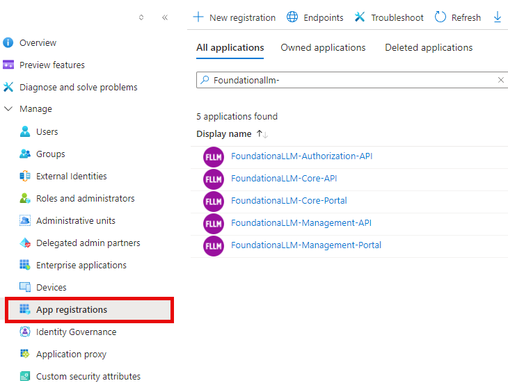

3. On the page that appears, select **+ New registration**.
4. When the **Register an application** page appears, enter a name for your application, such as *FoundationaLLM-ManagementClient*. You should indicate that this is for the management client application by appending *-ManagementClient* to the name.
5. Under **Supported account types**, select *Accounts in this organizational directory only*.
6. Select **Register**.

    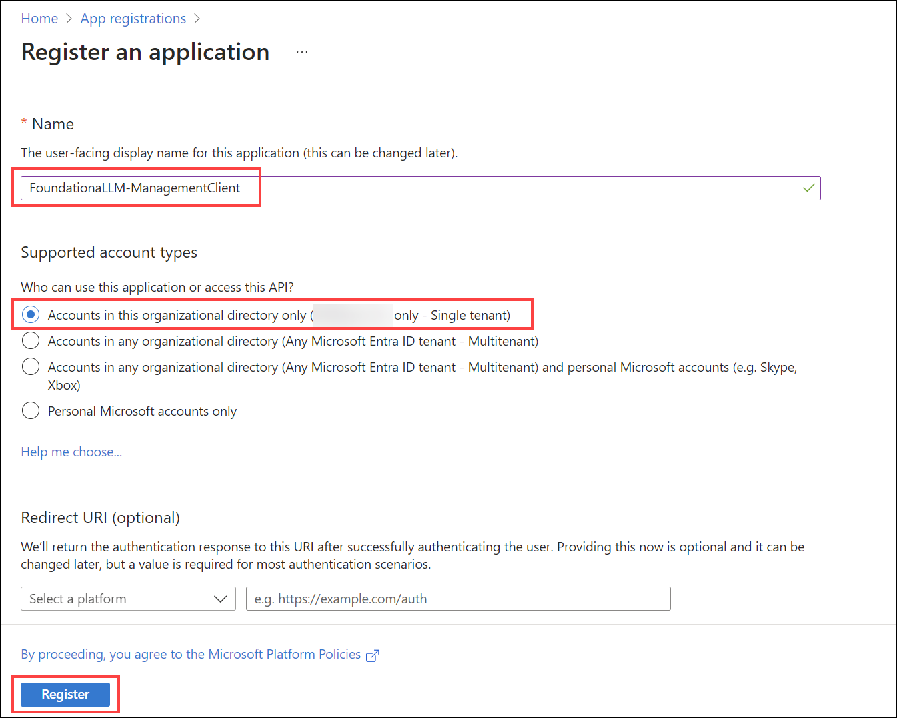

7. The application's **Overview** pane displays upon successful registration. Record the **Application (client) ID** and **Directory (tenant) ID** to add to your App Configuration settings later.

    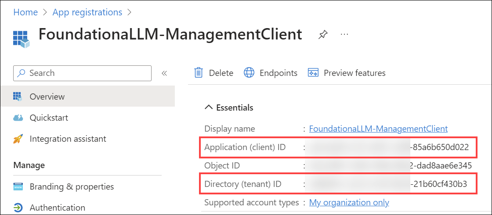

#### Add a redirect URI to the client application

1. Under **Manage**, select **Authentication**.
2. Under **Platform configurations**, select **Add a platform**. In the pane that opens, select **Single-page application**. This is for the Vue.js management application.
3. Add a **Redirect URI** under Single-page application for your deployed Vue.js management application. Enter `<YOUR_MANAGEMENT_APP_URL>/signin-oidc`, replacing `<YOUR_MANAGEMENT_APP_URL>` with the management UI application URL. For example, it should look something like `https://d85a09ce067141d5807a.eastus.aksapp.io/signin-oidc` for an AKS deployment, or `https://fllmaca002managementuica.graybush-c554b849.eastus.azurecontainerapps.io/signin-oidc` for an ACA deployment.
4. Add a **Redirect URI** under Single-page application for local development of the management portal Vue.js application: `http://localhost:3001/signin-oidc`.

    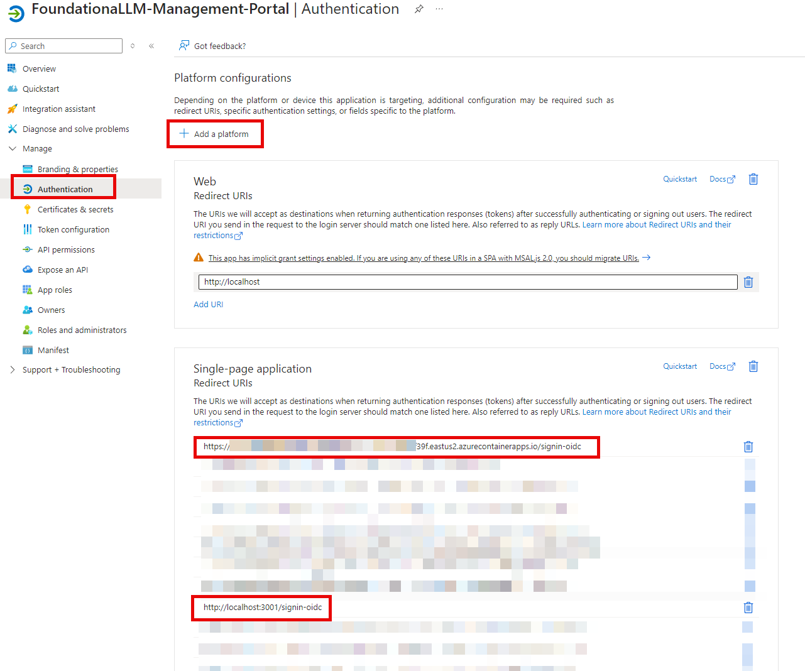

<!-- 8. Under **Front-channel logout URL**, enter `<YOUR_CHAT_APP_URL>/signout-oidc`. -->

If you wish to [configure authentication in Postman](../../development/directly-calling-apis.md#postman-collection) for executing calls against the Core API, you will need to add a **Redirect URI** under **Mobile and desktop applications** for Postman. Enter `https://oauth.pstmn.io/v1/callback` for the URI. To do this, complete the following steps:

1. Under **Platform configurations**, select **Add a platform**. In the pane that opens, select **Mobile and desktop applications**.
2. Enter `https://oauth.pstmn.io/v1/callback` for the **Custom redirect URIs** value.

    

3. Select **Configure** to apply the changes.

#### Implicit grant and hybrid flows for the client application

1. Check **Access tokens** and **ID tokens** under **Implicit grant**.
2. Select **Configure** to apply the changes (if the button is present).
3. Select **Save** at the bottom of the page to save the changes.

    

<!-- #### Client secret for the client application

1. Under **Manage**, select **Certificates & secrets**.
2. Under **Client secrets**, select **+ New client secret**.
3. For **Description**, enter a description for the secret. For example, enter *FoundationaLLM-ManagementClient*.
4. Select a desired expiration date.
5. Select **Add**.
6. **Record the secret value** to add to your App Configuration settings later. Do this by selecting the **Copy to clipboard** icon next to the secret value.

    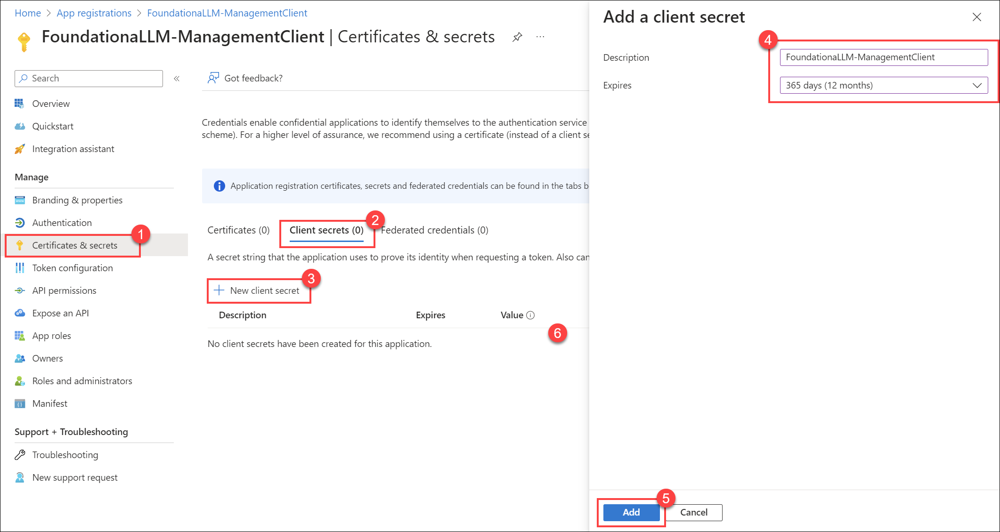 -->

#### Update the client application manifest

1. Under **Manage**, select **Manifest**.
2. Locate the `accessTokenAcceptedVersion` property and set its value to `2`.

    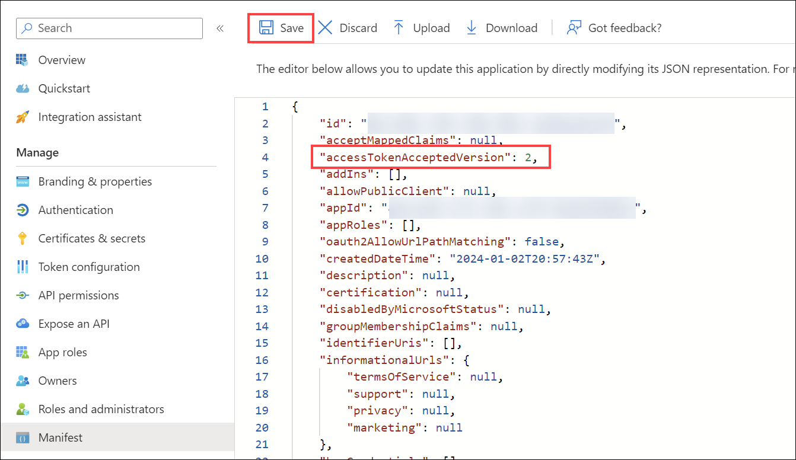

3. Select **Save** at the top of the page to save the changes.

### Create the API application

#### Register the API application in the Microsoft Entra ID admin center

1. Return to the [Microsoft Entra ID admin center](https://entra.microsoft.com).
2. Browse to **Identity** > **Applications** > **App registrations** and select **+ New registration**.

    

3. For **Name**, enter a name for the application. For example, enter *FoundationaLLM-Management*. Users of the app will see this name, and can be changed later.
4. Under **Supported account types**, select *Accounts in this organizational directory only*.
5. Select **Register**.

    

6. The application's **Overview** pane displays upon successful registration. Record the **Application (client) ID** and **Directory (tenant) ID** to add to your App Configuration settings later.

    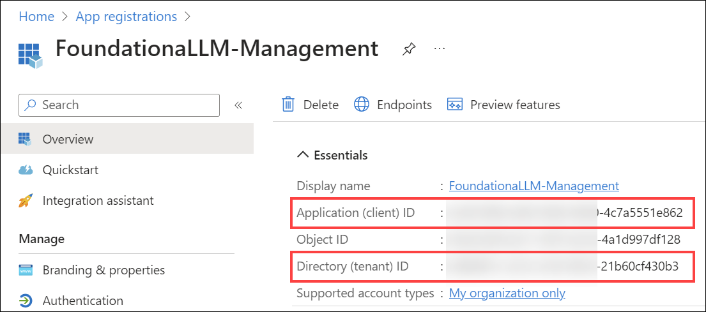

#### Implicit grant and hybrid flows for the API application

1. Select **Authentication** under **Manage** in the left-hand menu.
2. Select **+ Add a platform** under **Platform configurations**. In the pane that opens, select **Web**.
3. Under "Redirect URIs", enter `http://localhost` and select **Configure**. Please note that this value is not used in the FoundationaLLM solution, but is required in order to be able to select the access and ID tokens in the next step.

    

4. Check **Access tokens** and **ID tokens** under **Implicit grant**.
5. Select **Configure** to apply the changes.
6. Select **Save** at the bottom of the page to save the changes.

    

<!-- #### Client secret for the API application

1. Under **Manage**, select **Certificates & secrets**.
2. Under **Client secrets**, select **+ New client secret**.
3. For **Description**, enter a description for the secret. For example, enter *FoundationaLLM*.
4. Select a desired expiration date.
5. Select **Add**.
6. **Record the secret value** to add to your App Configuration settings later. Do this by selecting the **Copy to clipboard** icon next to the secret value.

    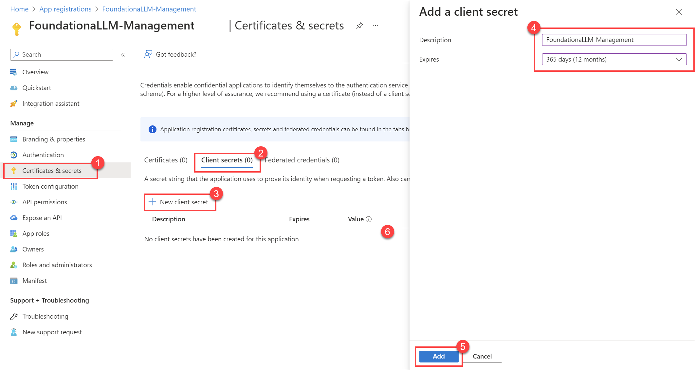 -->

#### Expose an API for the API application

1. Under **Manage**, select **Expose an API** > **Add a scope**. For **Application ID URI**, accept the default or specify a custom one, then select **Save and continue**, and then enter the following details:
   - **Scope name**: `Data.Manage`
   - **Who can consent?**: **Admins and users**
   - **Admin consent display name**: `Manage data on behalf of users`
   - **Admin consent description**: `Allows the app to manage data on behalf of the signed-in user.`
   - **User consent display name**: `Manage data on behalf of the user`
   - **User consent description**: `Allows the app to manage data on behalf of the signed-in user.`
   - **State**: **Enabled**
2. Select **Add scope** to complete the scope addition.

   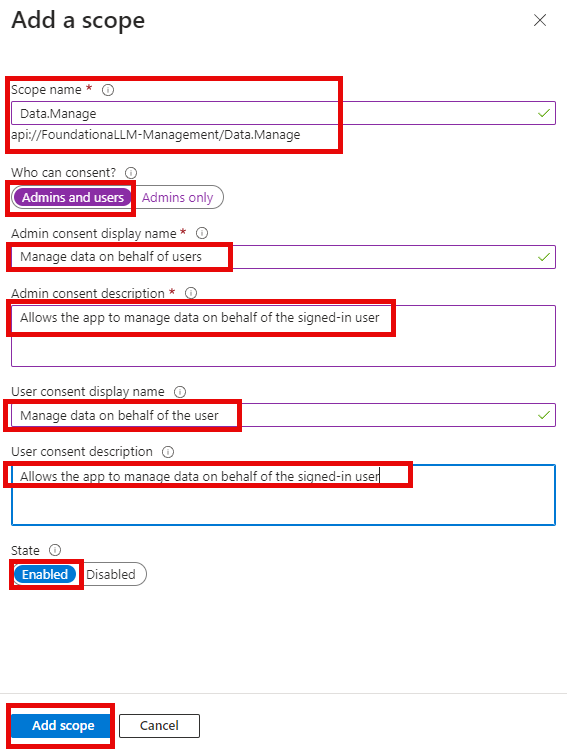

3. Copy the **Scope name** value to add to your App Configuration settings later. For example, it should look something like `api://c79a09ce067141d5832b/Data.Manage`.

   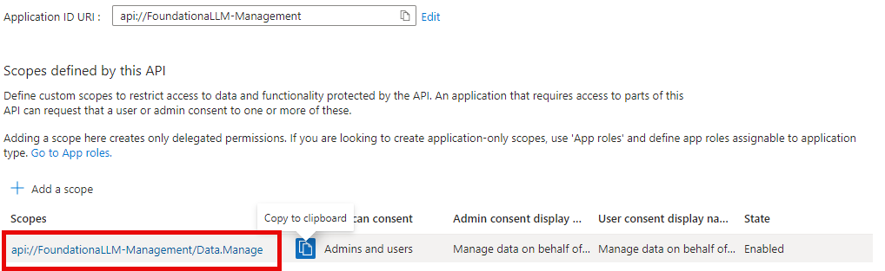

#### Add authorized client application

1. While still in the **Expose an API** section, select **+ Add a client application**.
2. Paste the **Application (client) ID** of the client application that you [created earlier](#register-the-client-application-in-the-microsoft-entra-admin-center).
3. Check the `Data.Manage` authorized scope that you created.
4. Select **Add application** to complete the client application addition.

    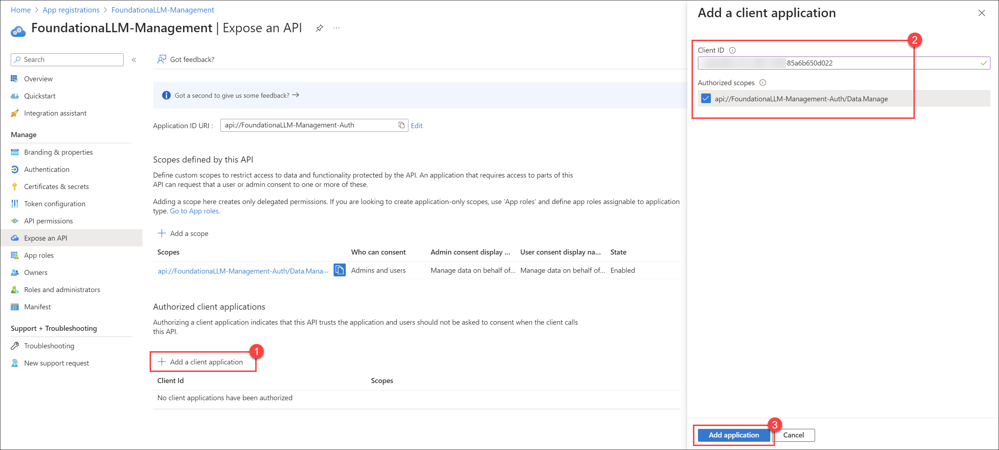

#### Update the API application manifest

1. Under **Manage**, select **Manifest**.
2. Locate the `accessTokenAcceptedVersion` property and set its value to `2`.

    

3. Select **Save** at the top of the page to save the changes.

### Add API permissions for the client application

1. Browse to **Identity** > **Applications** > **App registrations**.

    

2. Select the `FoundationaLLM-ManagementClient` application that you [created earlier](#register-the-client-application-in-the-microsoft-entra-admin-center).
3. Select **API permissions**.
4. Select **+ Add a permission** under the "Configured permissions" section.
5. In the "Request API permissions" pan, select the **My APIs** tab, then select the `FoundationaLLM-Management` API application.

    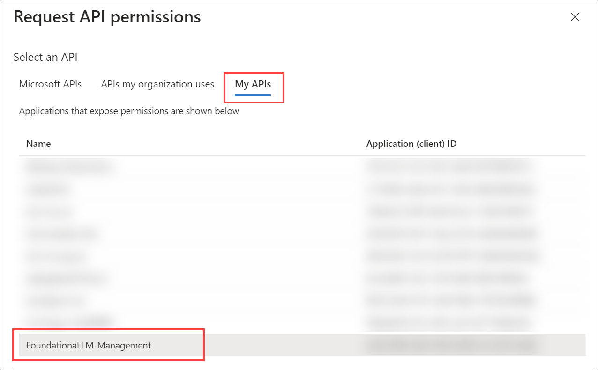

6. Select the `Data.Manage` scope that you created earlier, then select **Add permissions**.

    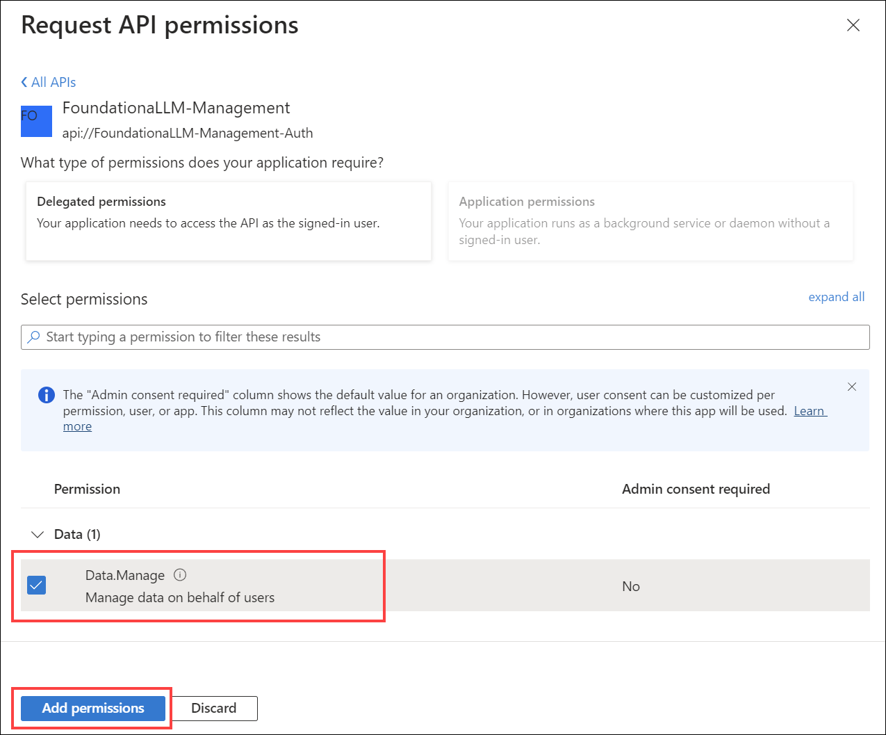

The client application's configured permissions should now look like the following:

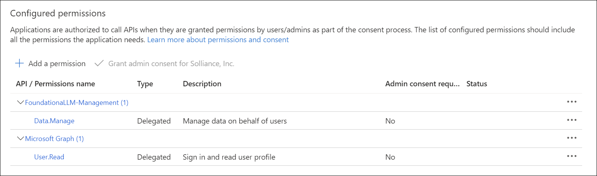

### Update App Configuration settings

1. Sign in to the [Azure portal](https://portal.azure.com/) as at least a Contributor.
2. Navigate to the resource group that was created as part of the deployment.
3. Select the **App Configuration** resource and select **Configuration explorer** to view the values.
4. Enter `entra` in the search box to filter the results.
5. Check the box next to **Key** in the header to select all items.
6. Select **Edit** to open a JSON editor for the selected items.

    

7. Replace the values for the following settings with the values that you recorded earlier:
   - `FoundationaLLM:Management:Entra:ClientId`: The **Application (client) ID** of the client application that you [created earlier](#register-the-client-application-in-the-microsoft-entra-admin-center).
   - `FoundationaLLM:Management:Entra:Scopes`: The fully-qualified scopes path for the API application that you [created earlier](#expose-an-api-for-the-api-application). For example, it should look something like `api://d85a09ce067141d5807a/Data.Manage`.
   - `FoundationaLLM:Management:Entra:TenantId`: The **Directory (tenant) ID** of the client application that you [created earlier](#register-the-client-application-in-the-microsoft-entra-admin-center).
   - `FoundationaLLM:ManagementAPI:Entra:ClientId`: The **Application (client) ID** of the API application that you [created earlier](#register-the-api-application-in-the-microsoft-entra-admin-center).
   - `FoundationaLLM:ManagementAPI:Entra:TenantId`: The **Directory (tenant) ID** of the API application that you [created earlier](#register-the-api-application-in-the-microsoft-entra-admin-center).

8. Validate the following values while reviewing the settings:
   - `FoundationaLLM:Management:Entra:CallbackPath`: Should be `/signin-oidc`.
   - `FoundationaLLM:Management:Entra:Instance`: Should be `https://login.microsoftonline.com/`.
   - `FoundationaLLM:ManagementAPI:Entra:Instance`: Should be `https://login.microsoftonline.com/`.
   - `FoundationaLLM:ManagementAPI:Entra:Scopes`: Should be `Data.Manage`.

9. Select **Apply** to save the changes.

<!-- ### Update Key Vault secrets

Key Vault stores the secrets for the client and API applications. You need to update the secrets with the values that you recorded earlier.

1. Return to the [Azure portal](https://portal.azure.com/).
2. Navigate to the resource group that was created as part of the deployment.
3. Select the **Key Vault** resource and select **Secrets**. If you cannot see the secrets, add your user account as a **Key Vault Secrets Officer** through Access Control (IAM). You need this role in order to access the secrets and update them as a required part of the authentication setup.
4. Open the `foundationallm-management-entra-clientsecret` secret, then select **+ New Version**.
5. Within the **Secret value** field, enter the **Client secret** of the client application that you [created earlier](#client-secret-for-the-client-application), then select **Create**.
6. Open the `foundationallm-managementapi-entra-clientsecret` secret, then select **+ New Version**.
7. Within the **Secret value** field, enter the **Client secret** of the API application that you [created earlier](#client-secret-for-the-api-application), then select **Create**. -->

## Next steps

Now that Entra authentication is fully configured, restart the Management API and management portal applications to apply the changes. Navigate to your management portal application or refresh the page if it is already open. It should automatically prompt you to sign in with your Microsoft Entra ID account.

<!-- ### Restart Management API and Management Portal UI applications in an ACA Deployment

To restart the Management API and management portal applications in an Azure Container Apps (ACA) deployment, you will need to navigate to the Management API and management portal applications and restart their container revisions, as indicated in the following Azure Portal screenshot:

   

   1. From the `Revisions` blade in the left navigation panel of the Core API or Chat UI container app detail page in Azure Portal, select the name of the running revision.
   2. A dialog panel titled `Revision details` should appear on the right side of the browser with a `Restart` button at the top.  Select the `Restart` button to restart the running container.

Restarting in this manner will need to be performed for both the Management API container app and the management portal container app.

### Restart Management API and Management Portal UI applications in an AKS Deployment

To restart the Management API and management portal applications in an Azure Kubernetes Service (AKS) deployment, you will need to navigate to the AKS detail page in Azure Portal and perform the following:

   1. Select the `Workloads` blade from the left navigation panel.
   2. Select the `Pods` tab from the `Workloads` detail page.
   3. Select the Core API and Chat UI pods from the list (it helps if you select `default` in the `Filter by namespace` dropdown first).
   4. Select the `Delete` button to terminate the currently running pods.  New pods will be instantiated to take their place.

    -->
