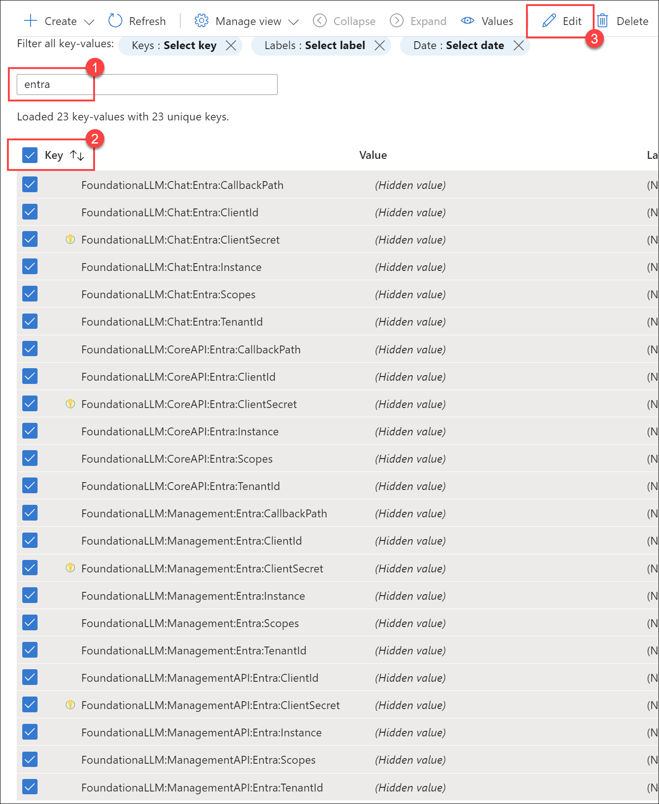
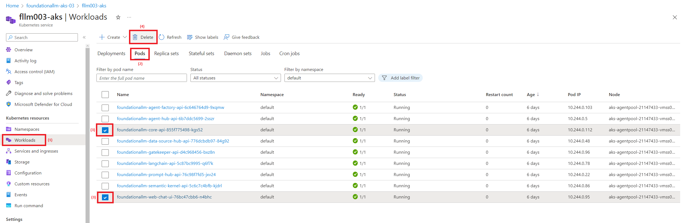

## Post Deployment
Follow the instruction below to complete the setup of Microsoft Entra ID authentication for the Management API and Management Portal applications after the deployment is complete.

### Update App Configuration settings

1. Sign in to the [Azure portal](https://portal.azure.com/) as at least a Contributor.
2. Navigate to the resource group that was created as part of the deployment.
3. Select the **App Configuration** resource and select **Configuration explorer** to view the values.
4. Enter `entra` in the search box to filter the results.
5. Check the box next to **Key** in the header to select all items.
6. Select **Edit** to open a JSON editor for the selected items.

    

7. Replace the values for the following settings with the values that you recorded earlier:
   - `FoundationaLLM:Management:Entra:ClientId`: The **Application (client) ID** of the client application that you [created earlier](#register-the-client-application-in-the-microsoft-entra-admin-center).
   - `FoundationaLLM:Management:Entra:Scopes`: The fully-qualified scopes path for the API application that you [created earlier](#expose-an-api-for-the-api-application). It should look like `api://FoundationaLLM.Management-API/Data.Manage`.
   - `FoundationaLLM:Management:Entra:TenantId`: The **Directory (tenant) ID** of the client application that you [created earlier](#register-the-client-application-in-the-microsoft-entra-admin-center).
   - `FoundationaLLM:ManagementAPI:Entra:ClientId`: The **Application (client) ID** of the API application that you [created earlier](#register-the-api-application-in-the-microsoft-entra-admin-center).
   - `FoundationaLLM:ManagementAPI:Entra:TenantId`: The **Directory (tenant) ID** of the API application that you [created earlier](#register-the-api-application-in-the-microsoft-entra-admin-center).

8. Validate the following values while reviewing the settings:
   - `FoundationaLLM:Management:Entra:CallbackPath`: Should be `/signin-oidc`.
   - `FoundationaLLM:Management:Entra:Instance`: Should be `https://login.microsoftonline.com/`.
   - `FoundationaLLM:ManagementAPI:Entra:Instance`: Should be `https://login.microsoftonline.com/`.
   - `FoundationaLLM:ManagementAPI:Entra:Scopes`: Should be `Data.Manage`.

9. Select **Apply** to save the changes.

<!-- ### Update Key Vault secrets

Key Vault stores the secrets for the client and API applications. You need to update the secrets with the values that you recorded earlier.

1. Return to the [Azure portal](https://portal.azure.com/).
2. Navigate to the resource group that was created as part of the deployment.
3. Select the **Key Vault** resource and select **Secrets**. If you cannot see the secrets, add your user account as a **Key Vault Secrets Officer** through Access Control (IAM). You need this role in order to access the secrets and update them as a required part of the authentication setup.
4. Open the `foundationallm-management-entra-clientsecret` secret, then select **+ New Version**.
5. Within the **Secret value** field, enter the **Client secret** of the client application that you [created earlier](#client-secret-for-the-client-application), then select **Create**.
6. Open the `foundationallm-managementapi-entra-clientsecret` secret, then select **+ New Version**.
7. Within the **Secret value** field, enter the **Client secret** of the API application that you [created earlier](#client-secret-for-the-api-application), then select **Create**. -->

## Next steps

Now that Entra authentication is fully configured, restart the Management API and management portal applications to apply the changes. Navigate to your management portal application or refresh the page if it is already open. It should automatically prompt you to sign in with your Microsoft Entra ID account.

<!-- ### Restart Management API and Management Portal UI applications in an ACA Deployment

To restart the Management API and management portal applications in an Azure Container Apps (ACA) deployment, you will need to navigate to the Management API and management portal applications and restart their container revisions, as indicated in the following Azure Portal screenshot:

   

   1. From the `Revisions` blade in the left navigation panel of the Core API or Chat UI container app detail page in Azure Portal, select the name of the running revision.
   2. A dialog panel titled `Revision details` should appear on the right side of the browser with a `Restart` button at the top.  Select the `Restart` button to restart the running container.

Restarting in this manner will need to be performed for both the Management API container app and the management portal container app.

### Restart Management API and Management Portal UI applications in an AKS Deployment

To restart the Management API and management portal applications in an Azure Kubernetes Service (AKS) deployment, you will need to navigate to the AKS detail page in Azure Portal and perform the following:

   1. Select the `Workloads` blade from the left navigation panel.
   2. Select the `Pods` tab from the `Workloads` detail page.
   3. Select the Core API and Chat UI pods from the list (it helps if you select `default` in the `Filter by namespace` dropdown first).
   4. Select the `Delete` button to terminate the currently running pods.  New pods will be instantiated to take their place.

    -->
