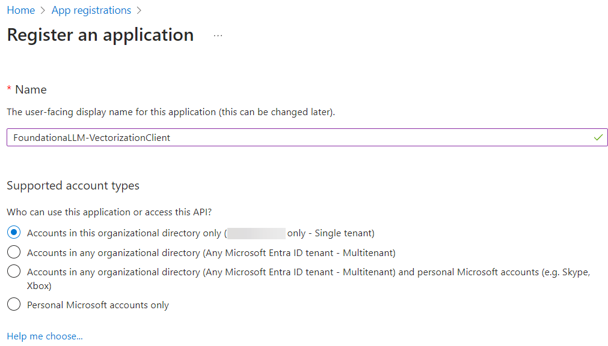
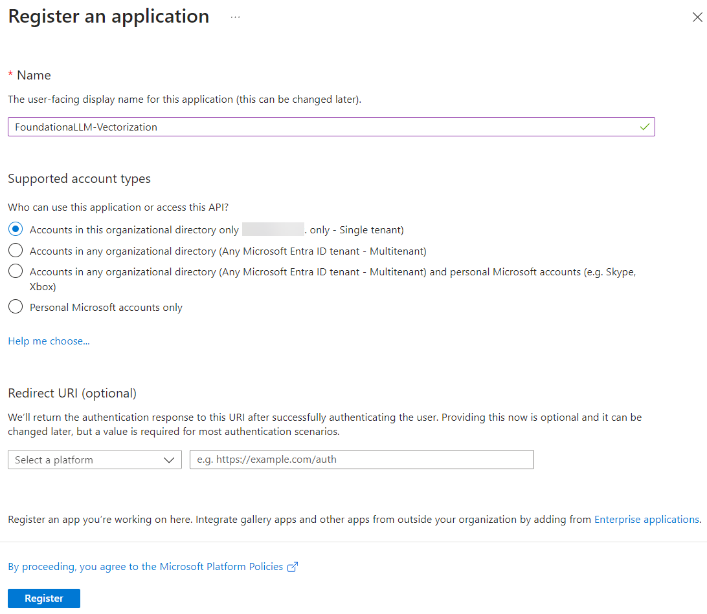
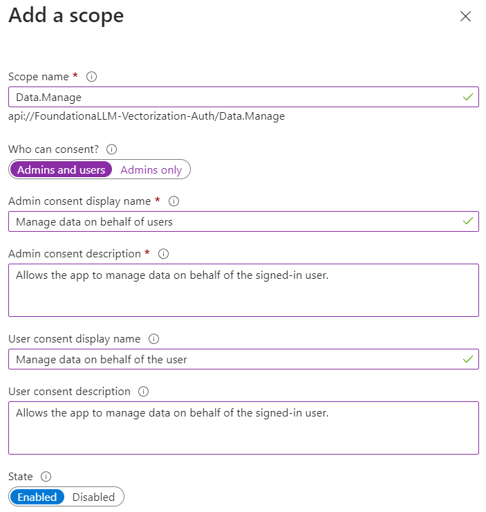
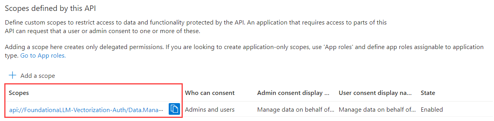
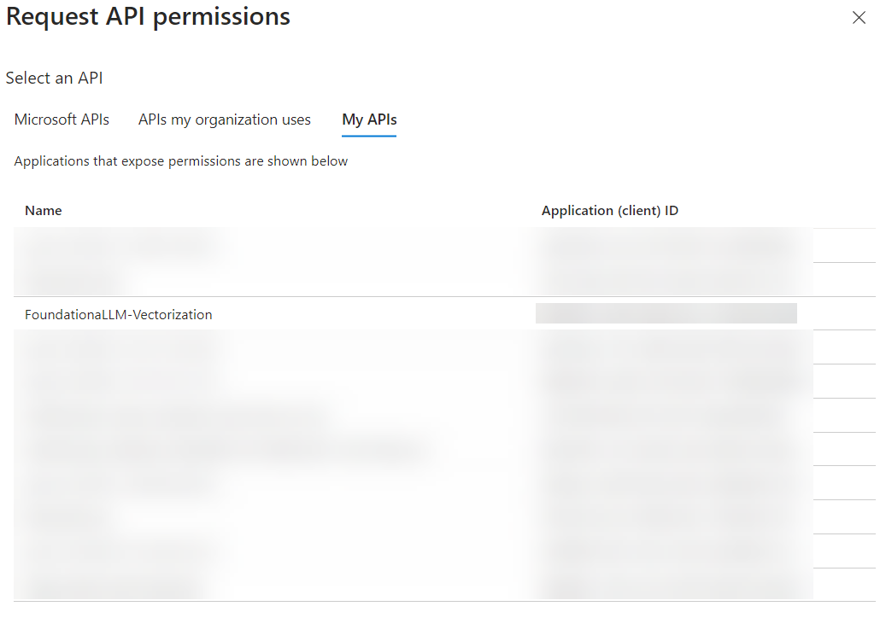
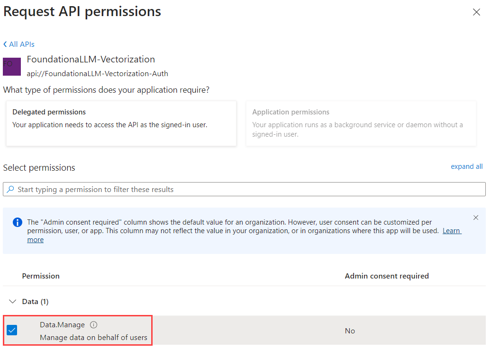
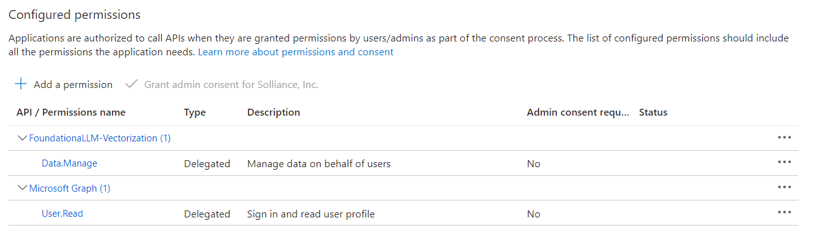

# Vectorization API and client authentication setup: Microsoft Entra ID

FoundationaLLM comes with out-of-the-box support for Microsoft Entra ID authentication, meaning that you can use Entra to protect access to the Vectorization API.

## Create the Microsoft Entra ID applications

To enable Microsoft Entra ID authentication for the Vectorization API, you need to create two applications in the Microsoft Azure portal:

- A client application that will be used by Vectorization API clients
- An API application that will be used by the Vectorization API to authenticate clients

### Create the client application

#### Register the client application in the Microsoft Entra ID admin center

1. Sign in to the [Microsoft Entra ID admin center](https://entra.microsoft.com/) as at least a Cloud Application Administrator.
2. Browse to **Identity** > **Applications** > **App registrations**.

    

3. On the page that appears, select **+ New registration**.
4. When the **Register an application** page appears, enter a name for your application, such as *FoundationaLLM-VectorizationClient*. You should indicate that this is for the vectorization client application by appending *-VectorizationClient* to the name.
5. Under **Supported account types**, select *Accounts in this organizational directory only*.
6. Select **Register**.

    

7. The application's **Overview** pane displays upon successful registration. Record the **Application (client) ID** and **Directory (tenant) ID** to add to your App Configuration settings later.

    

#### Add a redirect URI to the client application

If you wish to [configure authentication in Postman](../../development/directly-calling-apis.md#postman-collection) for executing calls against the Vectorization API, you will need to add a **Redirect URI** under **Mobile and desktop applications** for Postman. Enter `https://oauth.pstmn.io/v1/callback` for the URI. To do this, complete the following steps:

1. Under **Platform configurations**, select **Add a platform**. In the pane that opens, select **Mobile and desktop applications**.
2. Enter `https://oauth.pstmn.io/v1/callback` for the **Custom redirect URIs** value.

    

3. Select **Configure** to apply the changes.

#### Update the client application manifest

1. Under **Manage**, select **Manifest**.
2. Locate the `accessTokenAcceptedVersion` property and set its value to `2`.

    

3. Select **Save** at the top of the page to save the changes.

### Create the API application

#### Register the API application in the Microsoft Entra ID admin center

1. Return to the [Microsoft Entra ID admin center](https://entra.microsoft.com).
2. Browse to **Identity** > **Applications** > **App registrations** and select **+ New registration**.

    

3. For **Name**, enter a name for the application. For example, enter *FoundationaLLM-Vectorization*. Users of the app will see this name, and can be changed later.
4. Under **Supported account types**, select *Accounts in this organizational directory only*.
5. Select **Register**.

    

6. The application's **Overview** pane displays upon successful registration. Record the **Application (client) ID** and **Directory (tenant) ID** to add to your App Configuration settings later.

    

#### Implicit grant and hybrid flows for the API application

1. Select **Authentication** under **Manage** in the left-hand menu.
2. Select **+ Add a platform** under **Platform configurations**. In the pane that opens, select **Web**.
3. Under "Redirect URIs", enter `http://localhost` and select **Configure**. Please note that this value is not used in the FoundationaLLM solution, but is required in order to be able to select the access and ID tokens in the next step.

    

4. Check **Access tokens** and **ID tokens** under **Implicit grant**.
5. Select **Configure** to apply the changes.
6. Select **Save** at the bottom of the page to save the changes.

    

#### Expose an API for the API application

1. Under **Manage**, select **Expose an API** > **Add a scope**. For **Application ID URI**, accept the default or specify a custom one, then select **Save and continue**, and then enter the following details:
   - **Scope name**: `Data.Manage`
   - **Who can consent?**: **Admins and users**
   - **Admin consent display name**: `Manage data on behalf of users`
   - **Admin consent description**: `Allows the app to manage data on behalf of the signed-in user.`
   - **User consent display name**: `Manage data on behalf of the user`
   - **User consent description**: `Allows the app to manage data on behalf of the signed-in user.`
   - **State**: **Enabled**
2. Select **Add scope** to complete the scope addition.

   

3. Copy the **Scope name** value to add to your App Configuration settings later. For example, it should look something like `api://c79a09ce067141d5832b/Data.Manage`.

   

#### Add authorized client application

1. While still in the **Expose an API** section, select **+ Add a client application**.
2. Paste the **Application (client) ID** of the client application that you [created earlier](#register-the-client-application-in-the-microsoft-entra-admin-center).
3. Check the `Data.Manage` authorized scope that you created.
4. Select **Add application** to complete the client application addition.

    

#### Update the API application manifest

1. Under **Manage**, select **Manifest**.
2. Locate the `accessTokenAcceptedVersion` property and set its value to `2`.

    

3. Select **Save** at the top of the page to save the changes.

### Add API permissions for the client application

1. Browse to **Identity** > **Applications** > **App registrations**.

    

2. Select the `FoundationaLLM-VectorizationClient` application that you created earlier.
3. Select **API permissions**.
4. Select **+ Add a permission** under the "Configured permissions" section.
5. In the "Request API permissions" pan, select the **My APIs** tab, then select the `FoundationaLLM-Vectorization` API application.

    

6. Select the `Data.Manage` scope that you created earlier, then select **Add permissions**.

    

The client application's configured permissions should now look like the following:

### Update App Configuration settings

1. Sign in to the [Azure portal](https://portal.azure.com/) as at least a Contributor.
2. Navigate to the resource group that was created as part of the deployment.
3. Select the **App Configuration** resource and select **Configuration explorer** to view the values.
4. Create the following App Configuration key-value pairs:

   - `FoundationaLLM:VectorizationAPI:Entra:ClientId`: The **Application (client) ID** of the API application that you created earlier.
   - `FoundationaLLM:VectorizationAPI:Entra:Instance`: `https://login.microsoftonline.com/`
   - `FoundationaLLM:VectorizationAPI:Entra:TenantId`: The **Directory (tenant) ID** of the client application that you created earlier.
   - `FoundationaLLM:VectorizationAPI:Entra:Scopes`: `Data.Manage`
