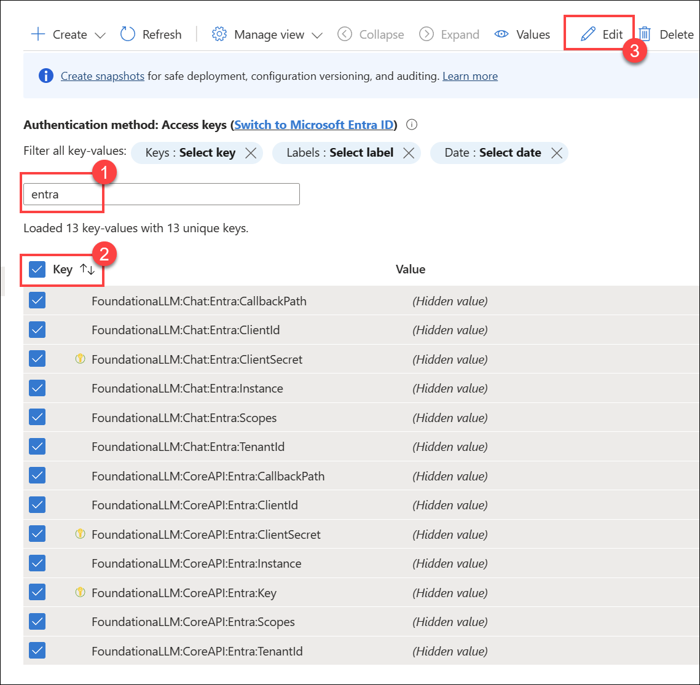

# Authentication setup: Microsoft Entra

FoundationaLLM comes with out-of-the-box support for Microsoft Entra authentication. This means that you can use your Microsoft Entra account to log in to the chat interface.

## Creating the Microsoft Entra applications

To enable Microsoft Entra authentication, you need to create two applications in the Microsoft Azure portal:

- A client application that will be used by the chat interface to authenticate users.
- An API application that will be used by the Core API to authenticate users.

### Pre-requisites

> [!NOTE]
> Make sure that you have [deployed the solution](../deployment/deployment-standard.md) before proceeding with the steps below.

1. The URL for your deployed chat application. You need this to assign the redirect URI for the client application.
2. The URL for the Core API. You need this to assign the redirect URI of the API application.

To obtain these URLs, follow the steps below:

1. Sign in to the [Azure portal](https://portal.azure.com/) as at least a Contributor.
2. Navigate to the resource group that was created as part of the deployment.
3. Select the **App Configuration** resource and select **Configuration explorer** to view the values. If you cannot access the configurations, add your user account as an **App Configuration Data Owner** through Access Control (IAM). You need this role in order to access the URLs and update the configurations as a required part of the authentication setup.
4. Search for view the `FoundationaLLM:APIs:CoreAPI:APIUrl` value. This is the URL for the Core API.

The URL for the chat application is the root URL of the Core API. For example, if the Core API URL is `https://d85a09ce067141d5807a.eastus.aksapp.io/core/`, then the chat application URL is `https://d85a09ce067141d5807a.eastus.aksapp.io/`.

### Creating the client application

#### Register the client application in the Microsoft Entra admin center

1. Sign in to the [Microsoft Entra admin center](https://entra.microsoft.com/) as at least a Cloud Application Administrator.
2. Browse to **Identity** > **Applications** > **App registrations**.
3. On the page that appears, select **+ New registration**.
4. When the **Register an application** page appears, enter a name for your application, such as *FoundationaLLM-Client*. You should indicate that this is for the client application by appending *-Client* to the name.
5. Under **Supported account types**, select *Accounts in this organizational directory only*.
6. Select **Register**.
7. The application's **Overview** pane displays upon successful registration. Record the **Application (client) ID** and **Directory (tenant) ID** to add to your App Configuration settings later.

#### Add a redirect URI to the client application

1. Under **Manage**, select **Authentication**.
2. Under **Platform configurations**, select **Add a platform**. In the pane that opens, select **Web**. This is for the Blazor version of the chat application.
3. For **Redirect URIs**, enter `<YOUR_CHAT_APP_URL>/signin-oidc`, replacing `<YOUR_CHAT_APP_URL>` with the chat application URL obtained in the [Pre-requisites](#pre-requisites) section above. For example, it should look something like `https://d85a09ce067141d5807a.eastus.aksapp.io/signin-oidc`.
4. Add another **Redirect URI** for local development. For **Redirect URIs**, enter `https://localhost:7258/signin-oidc`.
5. Under **Platform configurations**, select **Add a platform**. In the pane that opens, select **Single-page application**. This is for the Vue.js version of the chat application.
6. Add a **Redirect URI** under Single-page application for local development of the Vue.js application: `http://localhost:3000/signin-oidc`.
7. Under **Front-channel logout URL**, enter `<YOUR_CHAT_APP_URL>/signout-oidc`.

#### Implicit grant and hybrid flows for the client application

1. Check **Access tokens** and **ID tokens** under **Implicit grant**.
2. Select **Configure** to apply the changes.

#### Client secret for the client application

1. Under **Manage**, select **Certificates & secrets**.
2. Under **Client secrets**, select **+ New client secret**.
3. For **Description**, enter a description for the secret. For example, enter *FoundationaLLM-Client*.
4. Select a desired expiration date.
5. Select **Add**.
6. **Record the secret value** to add to your App Configuration settings later.

### Creating the API application

#### Register the API application in the Microsoft Entra admin center

1. Sign in to the [Microsoft Entra admin center](https://entra.microsoft.com) as at least a Cloud Application Administrator.
2. Browse to **Identity** > **Applications** > **App registrations** and select **+ New registration**.
3. For **Name**, enter a name for the application. For example, enter *FoundationaLLM*. Users of the app will see this name, and can be changed later.
4. Under **Supported account types**, select *Accounts in this organizational directory only*.
5. Select **Register**.
6. The application's **Overview** pane displays upon successful registration. Record the **Application (client) ID** and **Directory (tenant) ID** to add to your App Configuration settings later.

#### Add a redirect URI to the API application

1. Under **Manage**, select **Authentication**.
2. Under **Platform configurations**, select **Add a platform**. In the pane that opens, select **Web**.
3. For For **Redirect URIs**, enter `<YOUR_CORE_API_URL>/signin-oidc`, replacing `<YOUR_CORE_API_URL>` with the Core API URL obtained in the [Pre-requisites](#pre-requisites) section above. For example, it should look something like `https://d85a09ce067141d5807a.eastus.aksapp.io/core/signin-oidc`.
4. Add another **Redirect URI** for local development. For **Redirect URIs**, enter `https://localhost:63279/signin-oidc`.

#### Implicit grant and hybrid flows for the API application

1. Check **Access tokens** and **ID tokens** under **Implicit grant**.
2. Select **Configure** to apply the changes.

#### Client secret for the API application

1. Under **Manage**, select **Certificates & secrets**.
2. Under **Client secrets**, select **+ New client secret**.
3. For **Description**, enter a description for the secret. For example, enter *FoundationaLLM*.
4. Select a desired expiration date.
5. Select **Add**.
6. **Record the secret value** to add to your App Configuration settings later.

#### Expose an API for the API application

1. Under **Manage**, select **Expose an API** > **Add a scope**. For **Application ID URI**, accept the default or specify a custom one, then select **Save and continue**, and then enter the following details:
   - **Scope name**: `Data.Read`
   - **Who can consent?**: **Admins and users**
   - **Admin consent display name**: `Read data on behalf of users`
   - **Admin consent description**: `Allows the app to read data on behalf of the signed-in user.`
   - **User consent display name**: `Read data on behalf of the user`
   - **User consent description**: `Allows the app to read data on behalf of the signed-in user.`
   - **State**: **Enabled**
2. Select **Add scope** to complete the scope addition.
3. Copy the **Scope name** value to add to your App Configuration settings later. For example, it should look something like `api://d85a09ce067141d5807a/Data.Read`.

#### Add authorized client application

1. While still in the **Expose an API** section, select **+ Add a client application**.
2. Paste the **Application (client) ID** of the client application that you [created earlier](#register-the-client-application-in-the-microsoft-entra-admin-center).
3. Select **Add application** to complete the client application addition.

### Update App Configuration settings

1. Sign in to the [Azure portal](https://portal.azure.com/) as at least a Contributor.
2. Navigate to the resource group that was created as part of the deployment.
3. Select the **App Configuration** resource and select **Configuration explorer** to view the values.
4. Enter `entra` in the search box to filter the results.
5. Check the box next to **Key** in the header to select all items.
6. Select **Edit** to open a JSON editor for the selected items.

    

7. Replace the values for the following settings with the values that you recorded earlier:
   - `FoundationaLLM:Chat:Entra:CallbackPath`: Should be `/signin-oidc`.
   - `FoundationaLLM:Chat:Entra:ClientId`: The **Application (client) ID** of the client application that you [created earlier](#register-the-client-application-in-the-microsoft-entra-admin-center).
   - `FoundationaLLM:Chat:Entra:Instance`: Should be `https://login.microsoftonline.com/`.
   - `FoundationaLLM:Chat:Entra:Scopes`: The fully-qualified scopes path for the API application that you [created earlier](#expose-an-api-for-the-api-application). For example, it should look something like `api://d85a09ce067141d5807a/Data.Read`.
   - `FoundationaLLM:Chat:Entra:TenantId`: The **Directory (tenant) ID** of the client application that you [created earlier](#register-the-client-application-in-the-microsoft-entra-admin-center).
   - `FoundationaLLM:CoreAPI:Entra:CallbackPath`: Should be `/signin-oidc`.
   - `FoundationaLLM:CoreAPI:Entra:ClientId`: The **Application (client) ID** of the API application that you [created earlier](#register-the-api-application-in-the-microsoft-entra-admin-center).
   - `FoundationaLLM:CoreAPI:Entra:Instance`: Should be `https://login.microsoftonline.com/`.
   - `FoundationaLLM:CoreAPI:Entra:Scopes`: Should be `Data.Read`.
   - `FoundationaLLM:CoreAPI:Entra:TenantId`: The **Directory (tenant) ID** of the API application that you [created earlier](#register-the-api-application-in-the-microsoft-entra-admin-center).

8. Select **Apply** to save the changes.

### Update Key Vault secrets

Key Vault stores the secrets for the client and API applications. You need to update the secrets with the values that you recorded earlier.

1. Sign in to the [Azure portal](https://portal.azure.com/) as at least a Contributor.
2. Navigate to the resource group that was created as part of the deployment.
3. Select the **Key Vault** resource and select **Secrets**. If you cannot see the secrets, add your user account as a **Key Vault Secrets Officer** through Access Control (IAM). You need this role in order to access the secrets and update them as a required part of the authentication setup.
4. Open the `foundationallm-chat-entra-clientsecret` secret, then select **+ New Version**.
5. Within the **Secret value** field, enter the **Client secret** of the client application that you [created earlier](#client-secret-for-the-client-application), then select **Create**.
6. Open the `foundationallm-coreapi-entra-clientsecret` secret, then select **+ New Version**.
7. Within the **Secret value** field, enter the **Client secret** of the API application that you [created earlier](#client-secret-for-the-api-application), then select **Create**.

## Next steps

Now that Entra authentication is fully configured, restart the Core API and chat applications to apply the changes. Navigate to your chat application or refresh the page if it is already open. It should automatically prompt you to sign in with your Microsoft Entra account.
