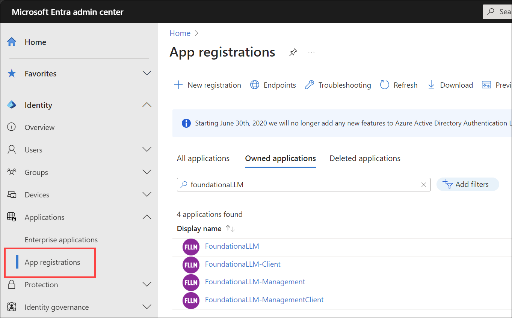
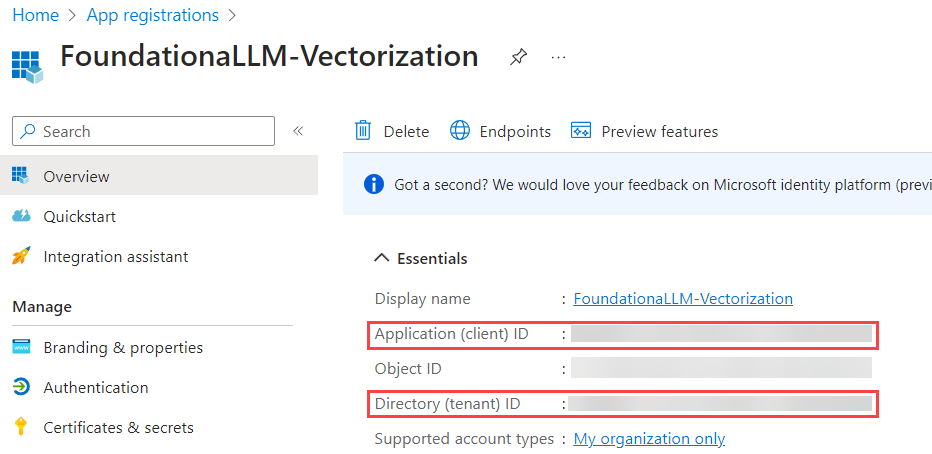
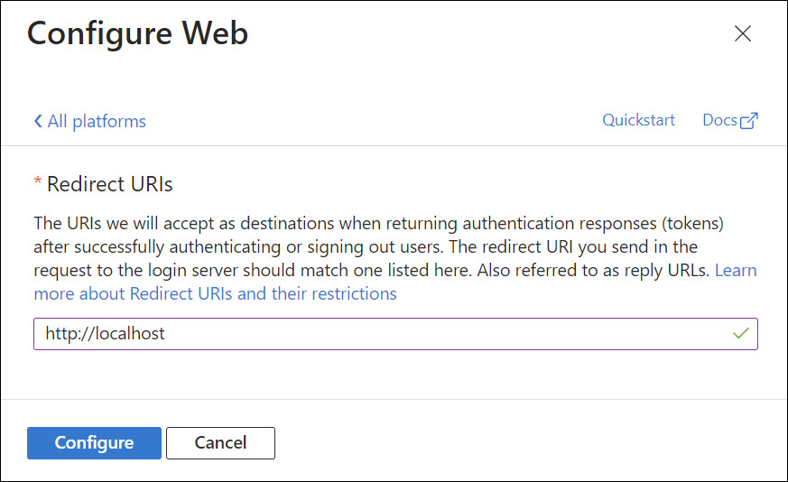

# Vectorization API Authentication

FoundationaLLM comes with out-of-the-box support for Microsoft Entra ID authentication, meaning that you can use Entra to protect access to the Vectorization API.

## Create the API application

### Register the API application in the Microsoft Entra ID admin center

1. Return to the [Microsoft Entra ID admin center](https://entra.microsoft.com).
2. Browse to **Identity** > **Applications** > **App registrations** and select **+ New registration**.

    

3. For **Name**, enter a name for the application. For example, enter *FoundationaLLM-Vectorization*. Users of the app will see this name, and can be changed later.
4. Under **Supported account types**, select *Accounts in this organizational directory only*.
5. Select **Register**.

    

6. The application's **Overview** pane displays upon successful registration. Record the **Application (client) ID** and **Directory (tenant) ID** to add to your App Configuration settings later.

    

### Implicit grant and hybrid flows for the API application

1. Select **Authentication** under **Manage** in the left-hand menu.
2. Select **+ Add a platform** under **Platform configurations**. In the pane that opens, select **Web**.
3. Under "Redirect URIs", enter `http://localhost` and select **Configure**. Please note that this value is not used in the FoundationaLLM solution, but is required in order to be able to select the access and ID tokens in the next step.

    

4. Check **Access tokens** and **ID tokens** under **Implicit grant**.
5. Select **Configure** to apply the changes.
6. Select **Save** at the bottom of the page to save the changes.

    

### Client secret for the API application

1. Under **Manage**, select **Certificates & secrets**.
2. Under **Client secrets**, select **+ New client secret**.
3. For **Description**, enter a description for the secret. For example, enter *FoundationaLLM*.
4. Select a desired expiration date.

    

5. Select **Add**.
6. **Record the secret value** to add to your App Configuration settings later. Do this by selecting the **Copy to clipboard** icon next to the secret value.

### Expose an API for the API application

1. Under **Manage**, select **Expose an API** > **Add a scope**. For **Application ID URI**, accept the default or specify a custom one, then select **Save and continue**, and then enter the following details:
   - **Scope name**: `Data.Manage`
   - **Who can consent?**: **Admins and users**
   - **Admin consent display name**: `Manage data on behalf of users`
   - **Admin consent description**: `Allows the app to manage data on behalf of the signed-in user.`
   - **User consent display name**: `Manage data on behalf of the user`
   - **User consent description**: `Allows the app to manage data on behalf of the signed-in user.`
   - **State**: **Enabled**
2. Select **Add scope** to complete the scope addition.

   

3. Copy the **Scope name** value to add to your App Configuration settings later. For example, it should look something like `api://c79a09ce067141d5832b/Data.Manage`.

   

### Update the API application manifest

1. Under **Manage**, select **Manifest**.
2. Locate the `accessTokenAcceptedVersion` property and set its value to `2`.

    

3. Select **Save** at the top of the page to save the changes.

### Update App Configuration settings

1. Sign in to the [Azure portal](https://portal.azure.com/) as at least a Contributor.
2. Navigate to the resource group that was created as part of the deployment.
3. Select the **App Configuration** resource and select **Configuration explorer** to view the values.
4. Create the following App Configuration key-value pairs:

   - `FoundationaLLM:VectorizationAPI:Entra:ClientId`: The **Application (client) ID** of the API application that you created earlier.
   - `FoundationaLLM:VectorizationAPI:Entra:Instance`: `https://login.microsoftonline.com/`
   - `FoundationaLLM:VectorizationAPI:Entra:TenantId`: The **Directory (tenant) ID** of the client application that you created earlier.
   - `FoundationaLLM:VectorizationAPI:Entra:Scopes`: `Data.Manage`

### Update Key Vault secrets

Key Vault stores the secrets for the client and API applications. You need to update the secrets with the values that you recorded earlier.

1. Return to the [Azure portal](https://portal.azure.com/).
2. Navigate to the resource group that was created as part of the deployment.
3. Select the **Key Vault** resource and select **Secrets**. If you cannot see the secrets, add your user account as a **Key Vault Secrets Officer** through Access Control (IAM). You need this role in order to access the secrets and update them as a required part of the authentication setup.
4. Open the `foundationallm-vectorizationapi-entra-clientsecret` secret, then select **+ New Version**.
5. Within the **Secret value** field, enter the **Client secret** of the API application that you created earlier, then select **Create**.
