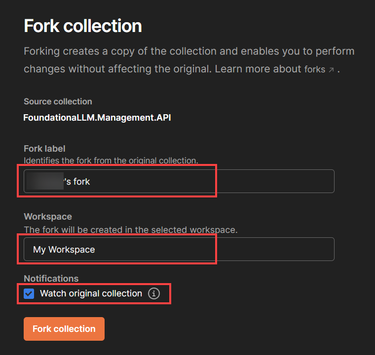
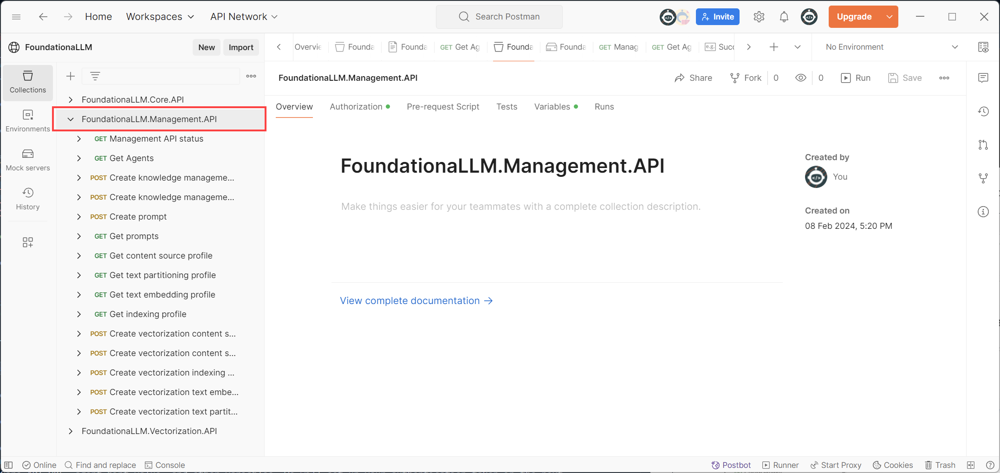
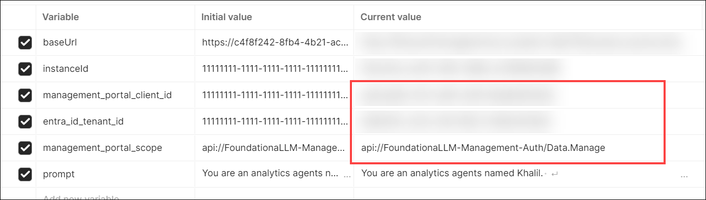
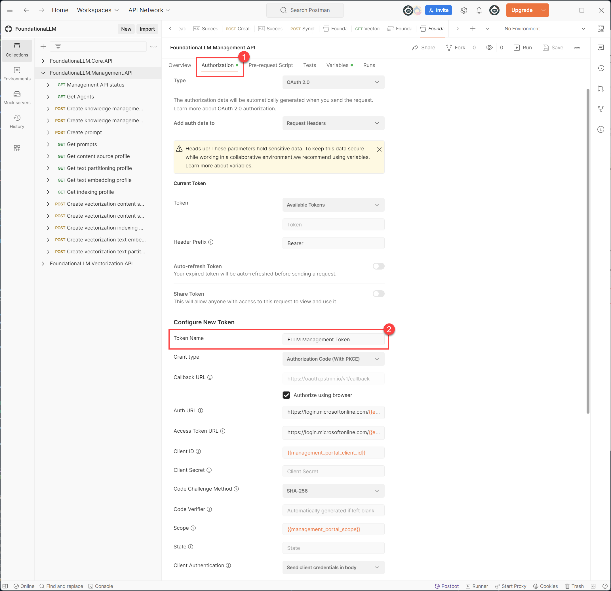

# Directly calling the Management API

This guide provides steps for importing and configuring the Postman collection for the FoundationaLLM Management API. The Management API is used to manage the FoundationaLLM system, including creating and managing agents, vectorization profiles, and more. Once you configure the Postman collection, including authentication, follow the instructions in the links below to perform various operations using the Management API:

- [Managing agents](../../setup-guides/agents/index.md)
- [Vectorization management](../../setup-guides/vectorization/index.md)

## Postman collection

The ability to test the API endpoints of FoundationaLLM is a critical part of the development process. Postman is a tool that allows you to do just that. This document will walk you through the process of setting up Postman to work with FoundationaLLM.

> [!TIP]
> To find the Management API URL for your deployment, you can retrieve it from your App Configuration resource in the portal by viewing the `FoundationaLLM:APIs:ManagementAPI:APIUrl` configuration value.

To see the API endpoints available in FoundationaLLM, you can get your Management API endpoint from your App Configuration resource in the portal and add `/swagger/` to the end of it. For example, if your Management API endpoint is `https://fllmaca729managementca.icelake-c554b849.eastus.azurecontainerapps.io`, then you would navigate to `https://fllmaca729managementca.icelake-c554b849.eastus.azurecontainerapps.io/swagger/` to see the API endpoints.

> [!NOTE]
> The example link above is for a [Quick Start deployment](../../deployment/deployment-quick-start.md) of FoundationaLLM, which deploys the APIs to Azure Container Apps (ACA). If you are using the standard deployment that deploys the APIs to Azure Kubernetes Service (AKS), then you cannot currently access the Swagger UI for the APIs. However, you will be able to obtain the OpenAPI swagger.json file from the Management API endpoint by navigating to `https://{{AKS URL}}/management/swagger/v1/swagger.json`.

### Install Postman

If you don't have Postman installed on your machine, visit the [Postman website](https://www.getpostman.com/) and download the app. Once you have it installed, Create a Blank Workspace.

### Import the Postman collection

1. First, select the button below to fork and import the Postman collection for the Management API.

    

2. Select **Fork Collection** to create a fork and import the collection into your Postman workspace.

    

3. Within the dialog that displays, enter your fork label, select the Postman workspace into which you want to create the fork, optionally check the *Watch original collection* checkbox to receive updates to the original collection, and then select **Fork collection**.

    

You will now see the **FoundationaLLM.Management.API** collection in your Postman workspace.

### Set up the Postman environment variables

The Postman collection you imported contains a number of API endpoints that you can use to test the Management API. However, before you can use these endpoints, you need to set up a Postman environment variables within your collection that contains the Management API URL and other variables. We will set up your authentication token in the next section.

1. Select the **FoundationaLLM.Management.API** collection in the left-hand menu.

2. Select the **Variables** tab.

    

    > [!NOTE]
    > The `Initial value` column is the value that will be used when you first import the collection. The `Current value` column is the value that will be used when you run the collection. If you change the `Current value` column, the `Initial value` column will not be updated. For the steps that follow, you will be updating the `Current value` column.

3. Update the `baseUrl` variable `Current value` with the Management API URL for your deployment.

    

4. Update the `instanceId` variable `Current value` with the instance ID of your FoundationaLLM deployment. You can find the instance ID in the `FoundationaLLM:Instance:Id` Azure App Configuration property.

    

5. Fill out the `tenantId`, `appClientId`, and `appScope` **Current value** settings for your **Management Client** Entra ID app registration ([setup instructions](../../deployment/authentication/management-authentication-setup-entra.md#register-the-client-application-in-the-microsoft-entra-id-admin-center)). Use the list below the screenshot to find the values.

    

    - **tenantId**: The tenant ID of your Management Client (Management Portal) Entra ID app. You can find this value in the **Overview** tab of your Entra ID app in the portal.
    - **appClientId**: The client ID of your Management Client Entra ID app. You can find this value in the **Overview** tab of your Entra ID app in the portal.
    - **appScope**: The scope of your Management Client Entra ID app. You can find this value in the **Api Permissions** section of your Entra ID app in the portal.

6. Select the **Save** button in the top right corner of the Variables pane to save your changes.

    

### Set up the Postman authentication token

#### Configure the Postman collection authorization token

Complete these steps to configure Postman to use the same token for all of the API calls in the collection.

> [!IMPORTANT]
> If you previously configured the Microsoft Entra ID app registration for the Management Client (UI) application, you will need to update the **Redirect URI** to `https://oauth.pstmn.io/v1/callback` in order to use the Postman mobile app to get the token. You can do this by following the steps in the [Add a redirect URI to the client application](../../deployment/authentication/management-authentication-setup-entra.md#add-a-redirect-uri-to-the-client-application) section of the authentication setup guide.

1. Select the **Authorization** tab within the **FoundationaLLM.Management.API** collection. You will see the **Authorization** tab at the collection level. This means that you can configure the token at the collection level and use it for all of the requests in the collection. Notice that the **Token Name** is **FLLM Management Token**. This will automatically be used by the requests in the collection.

    

> [!NOTE]
> All of the values are pre-filled and use the variables that you set up in the previous section. You do not need to change any values at this time.

Scroll down to the bottom of the page and click on **Get New Access Token**. This will open a new window in your browser and will ask you to login with your credentials.  Once you login, you will be asked to consent to the permissions that you specified in the **Scope** field.  Click on **Accept** to consent to the permissions.  You will then be redirected to the callback url that you specified in the **Callback Url** field.  This will close the browser window and will take you back to Postman. You should now see the token in the **Authorization** tab. Click on **Use Token** to use the token in the collection.

> [!IMPORTANT]
> Be sure to click the **Save** button in the top right corner of the Postman app to save your changes.

Now you are ready to make your first ManagementAPI request.

Within the **FoundationaLLM.Management.API** collection, select the **Get Agents** GET request. When you select the `Authorization` tab, notice that the selected type is `Inherit auth from parent`. This means that the request will use the token that you configured at the collection level. Also notice that the `{{baseUrl}}` and `{{instanceId}}` variables is used in the `Request Url` field. This means that the request will use the Management API URL and Instance Id that you configured at the collection level. Select the **Send** button to send the request. Even if you do not have any agents sessions in your system, you should receive a successful response (200) from the Management API.

Now you can use the same token to test any other request in the collection with ease.
