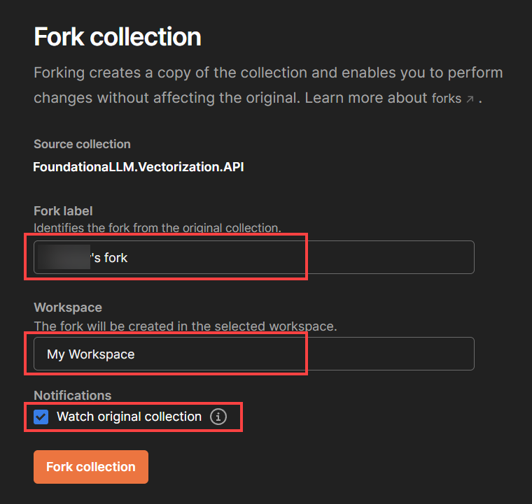
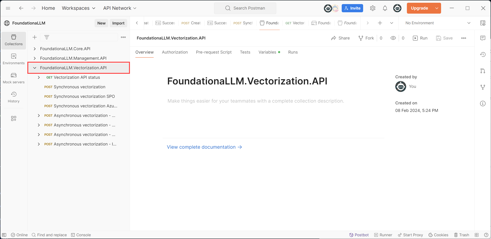
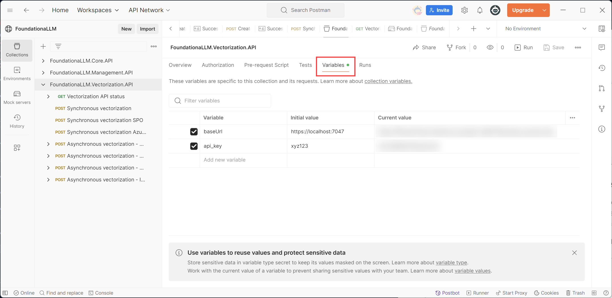
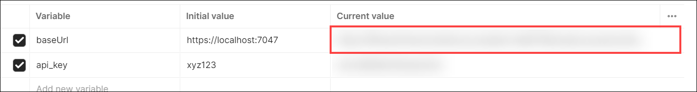
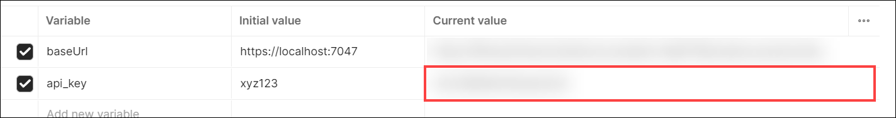
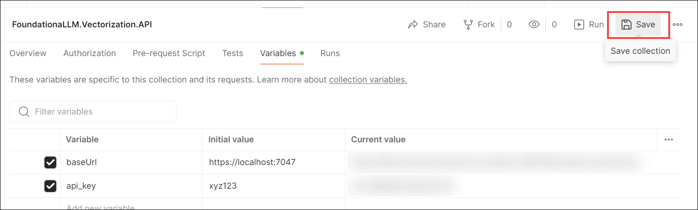

# Directly calling the Vectorization API

This guide provides steps for importing and configuring the Postman collection for the FoundationaLLM Vectorization API. The Vectorization API is used to execute vectorization pipelines by submitting requests with payloads that describe the vectorization process and desired steps to run. Once you configure the Postman collection, follow the instructions in the links below to perform various operations using the Vectorization API:

- [Vectorization concepts, configuration, and execution](../../setup-guides/vectorization/index.md)

## Postman collection

The ability to test the API endpoints of FoundationaLLM is a critical part of the development process. Postman is a tool that allows you to do just that. This document will walk you through the process of setting up Postman to work with FoundationaLLM.

> [!TIP]
> To find the Vectorization API URL for your deployment, you can retrieve it from your App Configuration resource in the portal by viewing the `FoundationaLLM:APIs:VectorizationAPI:APIUrl` configuration value.

To see the API endpoints available in FoundationaLLM, you can get your Vectorization API endpoint from your App Configuration resource in the portal and add `/swagger/` to the end of it. For example, if your Vectorization API endpoint is `https://fllmaca729vectorizationca.mountainrock-c554b849.eastus.azurecontainerapps.io`, then you would navigate to `https://fllmaca729vectorizationca.mountainrock-c554b849.eastus.azurecontainerapps.io/swagger/` to see the API endpoints.

> [!NOTE]
> The example link above is for a [starter deployment](../deployment/deployment-starter.md) of FoundationaLLM, which deploys the APIs to Azure Container Apps (ACA). If you are using the standard deployment that deploys the APIs to Azure Kubernetes Service (AKS), then you cannot currently access the Swagger UI for the APIs. However, you will be able to obtain the OpenAPI swagger.json file from the Vectorization API endpoint by navigating to `https://{{AKS URL}}/vectorization/swagger/v1/swagger.json`.

### Install Postman

If you don't have Postman installed on your machine, visit the [Postman website](https://www.getpostman.com/) and download the app. Once you have it installed, Create a Blank Workspace.

### Import the Postman collection

1. First, select the button below to fork and import the Postman collection for the Vectorization API.

    

2. Select **Fork Collection** to create a fork and import the collection into your Postman workspace.

    

3. Within the dialog that displays, enter your fork label, select the Postman workspace into which you want to create the fork, optionally check the *Watch original collection* checkbox to receive updates to the original collection, and then select **Fork collection**.

    

You will now see the **FoundationaLLM.Vectorization.API** collection in your Postman workspace.

### Set up the Postman environment variables

The Postman collection you imported contains a number of API endpoints that you can use to test the Vectorization API. However, before you can use these endpoints, you need to set up a Postman environment variables within your collection that contains the Vectorization API URL, agent hint value, and other variables. We will set up your authentication token in the next section.

1. Select the **FoundationaLLM.Vectorization.API** collection in the left-hand menu.

2. Select the **Variables** tab.

    

    > [!NOTE]
    > The `Initial value` column is the value that will be used when you first import the collection. The `Current value` column is the value that will be used when you run the collection. If you change the `Current value` column, the `Initial value` column will not be updated. For the steps that follow, you will be updating the `Current value` column.

3. Update the `baseUrl` variable `Current value` with the Vectorization API URL for your deployment.

    

4. Update the `api_key` variable `Current value` with the API Key of your Vectorization API deployment. You can find the API Key in the `foundationallm-apis-vectorizationapi-apikey` Key Vault secret.

    

5. Select the **Save** button in the top right corner of the Variables pane to save your changes.

    

You have now set up the Postman environment for the Vectorization API.
