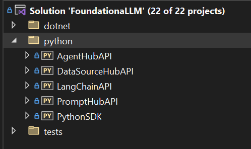
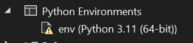
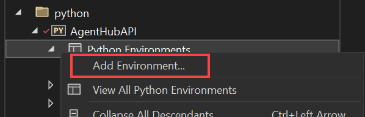
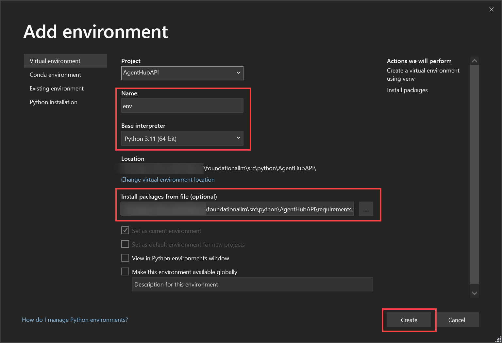
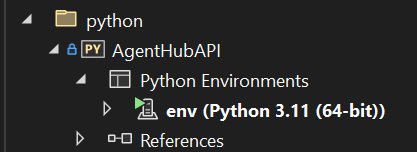
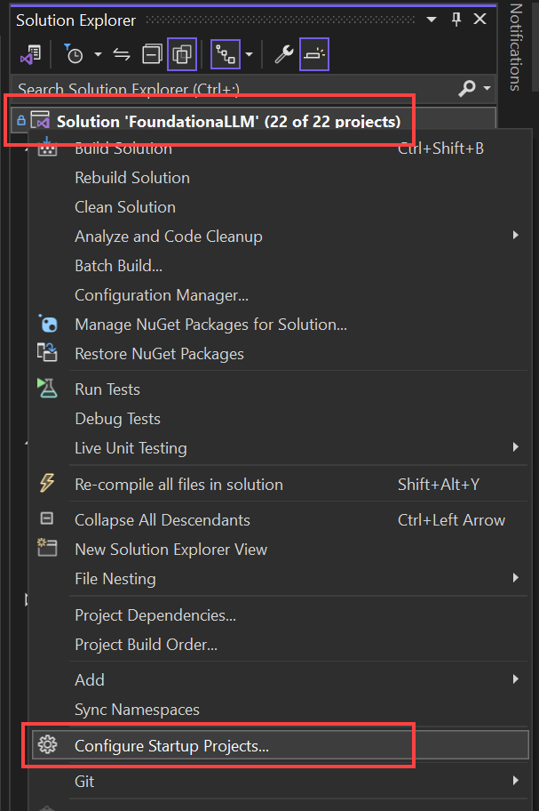
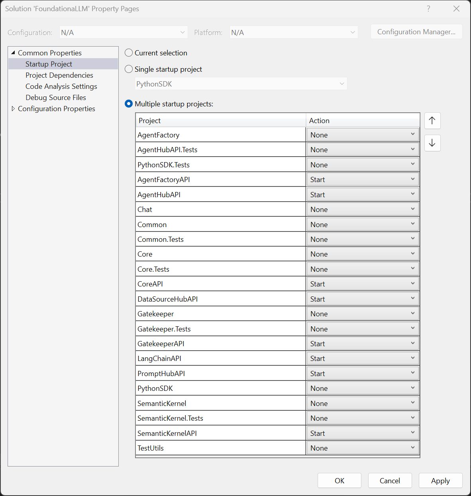

# Configure local development environment

## Prerequisites

- Environment variables:
  - Create a *system* environment variable for the Application Configuration Service connection string named `FoundationaLLM_AppConfig_ConnectionString`. This is used by the .NET projects.
  - Create a *system* environment variable for the Application Configuration Service URI named `FOUNDATIONALLM_APP_CONFIGURATION_URI`. This is used by the Python projects.
  - Create a *system* environment variable named `FOUNDATIONALLM_VERSION` and set it to the version of the FoundationaLLM deployment you are working with. This is used by the .NET projects to validate your environment configuration based on the version.

> [!TIP]
> You can view the FoundationaLLM release versions by viewing the [branches in the FoundationaLLM repository](https://github.com/solliancenet/foundationallm/branches/all?query=release). The format is `release/n.n.n`, where `n.n.n` is the version number. The `FOUNDATIONALLM_VERSION` environment variable should be set to the version number without the `release/` prefix (example: `0.4.0`).

- Follow the instructions in [Configure access control for services](../deployment/configure-access-control-for-services.md) to grant your user account access to the Azure App Configuration and Key Vault services. You may need an Azure admin to perform these steps on your behalf.
- Backend (APIs and worker services):
  - Visual Studio 2022 17.8 or later (required for passthrough Visual Studio authentication for the Docker container and .NET 8 support) with the [Python workload installed](https://learn.microsoft.com/visualstudio/python/installing-python-support-in-visual-studio?view=vs-2022)
  - [.NET 8 SDK](https://dotnet.microsoft.com/download/dotnet) or greater
  - [Python 3.11](https://www.python.org/downloads/) (learn more about [Python environments in Visual Studio](https://learn.microsoft.com/visualstudio/python/managing-python-environments-in-visual-studio?view=vs-2022))
  - Docker Desktop (with WSL for Windows machines) ([Mac install](https://docs.docker.com/desktop/install/mac-install/) or [Windows install](https://docs.docker.com/desktop/install/windows-install/))
  - Azure CLI ([v2.51.0 or greater](https://learn.microsoft.com/cli/azure/install-azure-cli))
  - [Microsoft Azure PowerShell](https://learn.microsoft.com/powershell/azure/install-azure-powershell)
  - [Helm 3.11.1 or greater](https://helm.sh/docs/intro/install/)
- Frontend (Vue.js (Nuxt) web app)
  - [Visual Studio Code](https://code.visualstudio.com/Download) (recommended for development)
  - [Node.js](https://nodejs.org/en/) v18.0.0 or newer
  - [NPM](https://www.npmjs.com/) v10.2.3 or newer
  - Recommended way to install the latest version of NPM and node.js on Windows:
    - Install NVM from https://github.com/coreybutler/nvm-windows
    - Run nvm install latest
    - Run nvm list (to see the versions of NPM/node.js available)
    - Run nvm use latest (to use the latest available version)

### Setup RBAC permissions when running locally

When you run the solution locally, you will need to set role-based access control (RBAC) permissions on the Azure Cosmos DB account. You can do this by running the following command in the Azure Cloud Shell or Azure CLI:

Assign yourself to the "Cosmos DB Built-in Data Contributor" role:

```bash
az cosmosdb sql role assignment create --account-name YOUR_COSMOS_DB_ACCOUNT_NAME --resource-group YOUR_RESOURCE_GROUP_NAME --scope "/" --principal-id YOUR_AZURE_AD_PRINCIPAL_ID --role-definition-id 00000000-0000-0000-0000-000000000002
```

## UI

### User Portal

The `UserPortal` project is a Vue.js (Nuxt) project. To configure it to run locally, follow these steps:

1. Open the `/src/ui/UserPortal` folder in Visual Studio Code.
2. Copy the `.env.example` file in the root directory to a new file named `.env` and update the values:
   1. The `APP_CONFIG_ENDPOINT` value should be the Connection String for the Azure App Configuration service. This should be the same value as the `FoundationaLLM_AppConfig_ConnectionString` environment variable.
   2. The `LOCAL_API_URL` should be the URL of the local Core API service (https://localhost:63279). **Important:** Only set this value if you wish to debug the entire solution locally and bypass the App Config service value for the CORE API URL. If you do not wish to debug the entire solution locally, leave this value empty or comment it out.

### Management Portal

The `ManagementPortal` project is a Vue.js (Nuxt) project. To configure it to run locally, follow these steps:

1. Open the `/src/ui/ManagementPortal` folder in Visual Studio Code.
2. Copy the `.env.example` file in the root directory to a new file named `.env` and update the values:
   1. The `APP_CONFIG_ENDPOINT` value should be the Connection String for the Azure App Configuration service. This should be the same value as the `FoundationaLLM_AppConfig_ConnectionString` environment variable.
   2. The `LOCAL_API_URL` should be the URL of the local Management API service (https://localhost:63267). **Important:** Only set this value if you wish to debug the entire solution locally and bypass the App Config service value for the MANAGEMENT API URL. If you do not wish to debug the entire solution locally, leave this value empty or comment it out.

## .NET projects

### Core API

#### Core API app settings

> Make sure the contents of the `appsettings.json` file has this structure and similar values:

```json
{
  "DetailedErrors": true,
  "Logging": {
    "LogLevel": {
      "Default": "Information",
      "Microsoft.AspNetCore": "Warning"
    }
  },
  "AllowedHosts": "*",
  "FoundationaLLM": {
    "AppConfig": {
      "ConnectionString": ""
    }
  }
}
```

> Create the `appsettings.Development.json` file or update it with the following content and replace all `<...>` placeholders with the values from your deployment:

```json
{  
  "FoundationaLLM": {
    "APIs": {
      "GatekeeperAPI": {
        "APIUrl": "<...>" // Default local value: https://localhost:7180/
      },
      ,
      "OrchestrationAPI": {
        "APIUrl": "<...>" // Default local value: "https://localhost:7324/"
      }
    }
  }
}
```

### CoreWorker

The `CoreWorker` project is a .NET worker service that acts as the Cosmos DB change feed processor. When you debug it locally, it runs within a Docker container. Because of this, it is important to make sure the App Configuration service connection string is set in the `appsettings.Development.json` file. This is because the Docker container will not have access to the environment variable.

#### CoreWorker app settings

> Make sure the contents of the `appsettings.json` file has this structure and similar values:

```json
{
  "DetailedErrors": true,
  "Logging": {
    "LogLevel": {
      "Default": "Information",
      "Microsoft.AspNetCore": "Warning"
    }
  },
  "FoundationaLLM": {
    "AppConfig": {
      "ConnectionString": ""
    }
  }
}
```

> Create the `appsettings.Development.json` file or update it with the following content and replace all `<...>` placeholders with the values from your deployment:

```json
{  
  "FoundationaLLM": {
    "AppConfig": {
      "ConnectionString": "<...>"
    }
  }
}
```

### Gatekeeper API

#### Gatekeeper API app settings

> Make sure the contents of the `appsettings.json` file has this structure and similar values:

```json
{
  "Logging": {
    "LogLevel": {
      "Default": "Information",
      "Microsoft.AspNetCore": "Warning"
    },
    "ApplicationInsights": {
      "LogLevel": {
        "Default": "Information",
        "Microsoft.AspNetCore": "Warning"
      }
    }
  },
  "AllowedHosts": "*",
  "FoundationaLLM": {
    "AppConfig": {
      "ConnectionString": ""
    }
  }
}
```

> Create the `appsettings.Development.json` file or update it with the following content and replace all `<...>` placeholders with the values from your deployment:

```json
{
  "FoundationaLLM": {
    "APIs": {
      "OrchestrationAPI": {
        "APIUrl": "<...>"  // Default local value: https://localhost:7324/
      },
      "GatekeeperIntegrationAPI": {
        "APIUrl": "<...>"  // Default local value: http://localhost:8042/
      }
    }
  }
}
```

### Orchestration API

#### Orchestration API app settings

> Make sure the contents of the `appsettings.json` file has this structure and similar values:

```json
{
  "Logging": {
    "LogLevel": {
      "Default": "Information",
      "Microsoft.AspNetCore": "Warning"
    },
    "ApplicationInsights": {
      "LogLevel": {
        "Default": "Information",
        "Microsoft.AspNetCore": "Warning"
      }
    }
  },
  "AllowedHosts": "*",
  "FoundationaLLM": {
    "AppConfig": {
      "ConnectionString": ""
    }
  }
}
```

> Create the `appsettings.Development.json` file or update it with the following content and replace all `<...>` placeholders with the values from your deployment:

```json
{
  "FoundationaLLM": {
    "APIs": {
      "LangChainAPI": {
        "APIUrl": "<...>"  // Default local value: http://localhost:8765/
      },
      "SemanticKernelAPI": {
        "APIUrl": "<...>"  // Default local value: https://localhost:7062/
      },
      "AgentHubAPI": {
        "APIUrl": "<...>"  // Default local value: http://localhost:8742/
      },
      "PromptHubAPI": {
        "APIUrl": "<...>"  // Default local value: http://localhost:8642/
      },
      "DataSourceHubAPI": {
        "APIUrl": "<...>"  // Default local value: http://localhost:8842/
      }
    }
  }
}
```

### Semantic Kernel API

#### Semantic Kernel API app settings

> Make sure the contents of the `appsettings.json` file has this structure and similar values:

```json
{
  "Logging": {
    "LogLevel": {
      "Default": "Information",
      "Microsoft.AspNetCore": "Warning",
      "Microsoft.SemanticKernel": "Error"
    },
    "ApplicationInsights": {
      "LogLevel": {
        "Default": "Information",
        "Microsoft.AspNetCore": "Warning",
        "Microsoft.SemanticKernel": "Error"
      }
    }
  },
  "AllowedHosts": "*",
  "FoundationaLLM": {
    "CognitiveSearch": {
      "IndexName": "vector-index",
      "MaxVectorSearchResults": 10
    },
    "OpenAI": {
      "CompletionsDeployment": "completions",
      "CompletionsDeploymentMaxTokens": 8096,
      "EmbeddingsDeployment": "embeddings",
      "EmbeddingsDeploymentMaxTokens": 8191,
      "ChatCompletionPromptName": "RetailAssistant.Default",
      "ShortSummaryPromptName": "Summarizer.TwoWords",
      "PromptOptimization": {
        "CompletionsMinTokens": 50,
        "CompletionsMaxTokens": 300,
        "SystemMaxTokens": 1500,
        "MemoryMinTokens": 1500,
        "MemoryMaxTokens": 3000,
        "MessagesMinTokens": 100,
        "MessagesMaxTokens": 3000
      }
    },
    "DurableSystemPrompt": {
      "BlobStorageContainer": "prompts"
    },
    "CognitiveSearchMemorySource": {
      "IndexName": "vector-index",
      "ConfigBlobStorageContainer": "memory-source",
      "ConfigFilePath": "ACSMemorySourceConfig.json"
    },
    "BlobStorageMemorySource": {
      "ConfigBlobStorageContainer": "memory-source",
      "ConfigFilePath": "BlobMemorySourceConfig.json"
    },
    "SemanticKernelOrchestration": {
      "APIKeySecretName": "foundationallm-semantickernel-api-key"
    }
  }
}
```

> Create the `appsettings.Development.json` file or update it with the following content and replace all `<...>` placeholders with the values from your deployment:

```json
{
  "FoundationaLLM": {
    "CognitiveSearch": {
      "Endpoint": "https://<...>-cog-search.search.windows.net",
      "Key": "<...>"
    },
    "OpenAI": {
      "Endpoint": "https://<...>-openai.openai.azure.com/",
      "Key": "<...>"
    },
    "DurableSystemPrompt": {
      "BlobStorageConnection": "<...>"
    },
    "CognitiveSearchMemorySource": {
      "Endpoint": "https://<...>-cog-search.search.windows.net",
      "Key": "<...>",
      "ConfigBlobStorageConnection": "<...>"
    },
    "BlobStorageMemorySource": {
      "ConfigBlobStorageConnection": "<...>"
    }
  }
}
```

## Python projects

### Python Environment Variables

Create a local environment variable named `FOUNDATIONALLM_APP_CONFIGURATION_URI`. The value should be the URI of the Azure App Configuration service and _not_ the connection string. We use role-based access controls (RBAC) to access the Azure App Configuration service, so the connection string is not required.

| Name | Value | Description |
| ---- | ----- | ----------- |
| FOUNDATIONALLM_APP_CONFIGURATION_URI | REDACTED | Azure App Configuration URI |

## Running the solution locally

### Configure and run the backend components

The backend components consist of the .NET projects and the Python projects. The .NET projects are all ASP.NET Core Web API projects. The Python projects are all FastAPI projects.

1. Open the solution in Visual Studio 2022 17.6 or later. The solution file is located at `/src/FoundationaLLM.sln`.
2. Reference the API sections above to configure the app settings for each project. This primarily involves just creating the `appsettings.development.json` file for each of the .NET (located under the `dotnet` solution folder) API projects and adding the documented values within. For local development, use the `localhost` URLs for each of the API projects.

    > [!NOTE]
    > The `appsettings.development.json` files are excluded from source control. This is to prevent sensitive information from being committed to source control. You will need to create these files locally.

    

3. Expand the `python` solution folder.

    

4. Expand the `AgentHubAPI` project, then expand the `Python Environments` folder underneath it. You will likely see a warning icon next to an environment named `env`. This is because the Python environment has not been created yet.

    

5. Right-click the `Python Environments` folder and select `Add Environment...`.

    

6. Ensure the **Name** field is set to `env` and the **Version** field is set to `Python 3.11` (or your latest version). Also make sure the **Install packages from file** field is set to the `requirements.txt` file for the project. This will install the required Python packages after creating the environment. Click **Create**.

    

7. You should now see the `env` environment listed under the `Python Environments` folder. The warning icon should be gone.

    

8. Complete steps 4-7 for the `DataSourceHubAPI`, `LangChainAPI`, `PromptHubAPI`, and `PythonSDK` projects. You may optionally complete these steps for the Python test projects as well.

9. Right-click the Solution in Visual Studio, then select `Configure Startup Projects...`.

    

10. Select the `Multiple startup projects` option, then set the `Action` for the following projects to `Start`. Click **OK**.
  
      - OrchestrationAPI
      - AgentHubAPI
      - CoreAPI
      - DataSourceHubAPI
      - GatekeeperAPI
      - GatekeeperIntegrationAPI
      - LangChainAPI
      - PromptHubAPI
      - SemanticKernelAPI
      - ManagementAPI
      - VectorizationAPI
  
      

1. Press `F5` to start debugging the solution. This will start all of the .NET projects and the Python projects. The Vue.js (Nuxt) web app will not be started by default. To start it, follow the steps below.

### Configure and run the frontend components

The frontend components consist of the Vue.js (Nuxt) web apps.

#### Run the User Portal

The `UserPortal` project is a Vue.js (Nuxt) project. To configure it to run locally, follow these steps

1. Open the `/src/ui/UserPortal` folder in Visual Studio Code.

2. Open the `.env` file and update the `LOCAL_API_URL` value to the URL of the local Core API service (https://localhost:63279). **Important:** Only set this value if you wish to debug the entire solution locally and bypass the App Config service value for the CORE API URL. If you do not wish to debug the entire solution locally, leave this value empty or comment it out.

3. Open a terminal in Visual Studio Code and run the following commands:

    ```bash
    npm install
    npm run dev
    ```

4. The web app should now be running at http://localhost:3000.

#### Run the Management Portal

The `ManagementPortal` project is a Vue.js (Nuxt) project. To configure it to run locally, follow these steps

1. Open the `/src/ui/Management` folder in Visual Studio Code.

2. Open the `.env` file and update the `LOCAL_API_URL` value to the URL of the local Core API service (https://localhost:63267). **Important:** Only set this value if you wish to debug the entire solution locally and bypass the App Config service value for the MANAGEMENT API URL. If you do not wish to debug the entire solution locally, leave this value empty or comment it out.

3. Open a terminal in Visual Studio Code and run the following commands:

    ```bash
    npm install
    npm run dev
    ```

4. The web app should now be running at http://localhost:3001.

