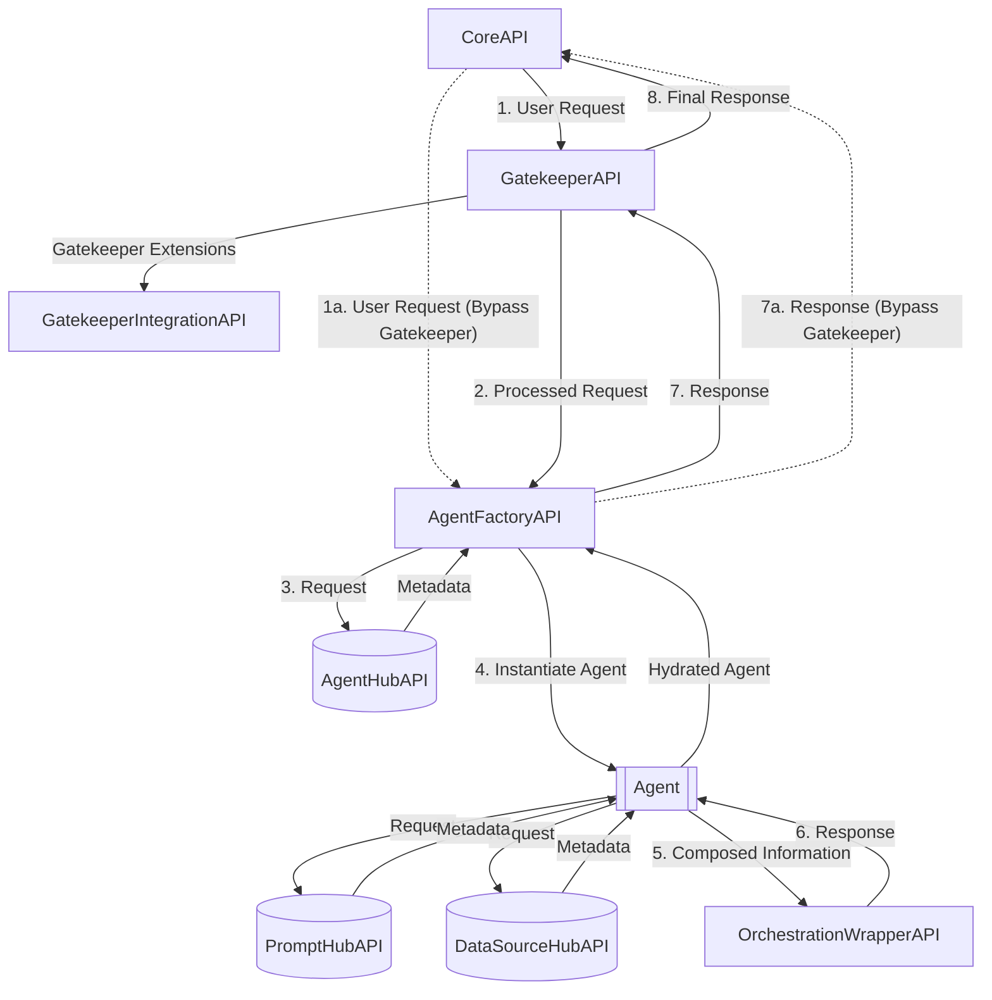

# Directly calling the APIs

Typically, the only interaction with the Foundationa**LLM** (FLLM) APIs is indirectly through the User Portal and Management Portal. However, you can also call the APIs directly to perform certain tasks, such as using your [configured FLLM agents](../setup-guides/agents/index.md) to perform completions (via the Core API), or updating your branding configurations (via the Management API).

## API architecture

The FLLM architecture contains layers of APIs that are used to perform different tasks along a call chain, starting with the **Core API**. The following diagram shows the API architecture:

> [!NOTE]
> Notice that there is an alternate path that bypasses the Gatekeeper API. This path is used when the `FoundationaLLM:APIs:CoreAPI:BypassGatekeeper` configuration value is set to `true`. By default, the Core API does not bypass the Gatekeeper API. Beware that bypassing the Gatekeeper means that you bypass content protection and filtering in favor of improved performance. Make sure you understand the risks before setting this value to `true`.

## Postman collection

The ability to test the API endpoints of FoundationaLLM is a critical part of the development process. Postman is a tool that allows you to do just that. This document will walk you through the process of setting up Postman to work with FoundationaLLM.

> [!TIP]
> To find the Core API URL for your deployment, you can retrieve it from your App Configuration resource in the portal by viewing the `FoundationaLLM:APIs:CoreAPI:APIUrl` configuration value.

To see the API endpoints available in FoundationaLLM, you can get your Core API endpoint from your App Configuration resource in the portal and add `/swagger/` to the end of it. For example, if your Core API endpoint is `https://foundationallm-core-api.azurewebsites.net`, then you would navigate to `https://foundationallm-core-api.azurewebsites.net/swagger/` to see the API endpoints.

> [!NOTE]
> The example link above is for a [starter deployment](../deployment/starter-deployment.md) of FoundationaLLM, which deploys the APIs to Azure Container Apps (ACA). If you are using the standard deployment that deploys the APIs to Azure Kubernetes Service (AKS), then you cannot currently access the Swagger UI for the APIs. However, you will be able to obtain the OpenAPI swagger.json file from the Core API endpoint by navigating to `https://{{AKS URL}}/core/swagger/v1/swagger.json`.
