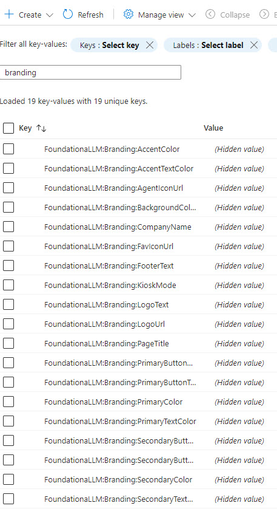
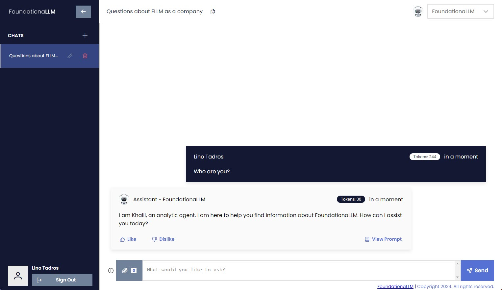
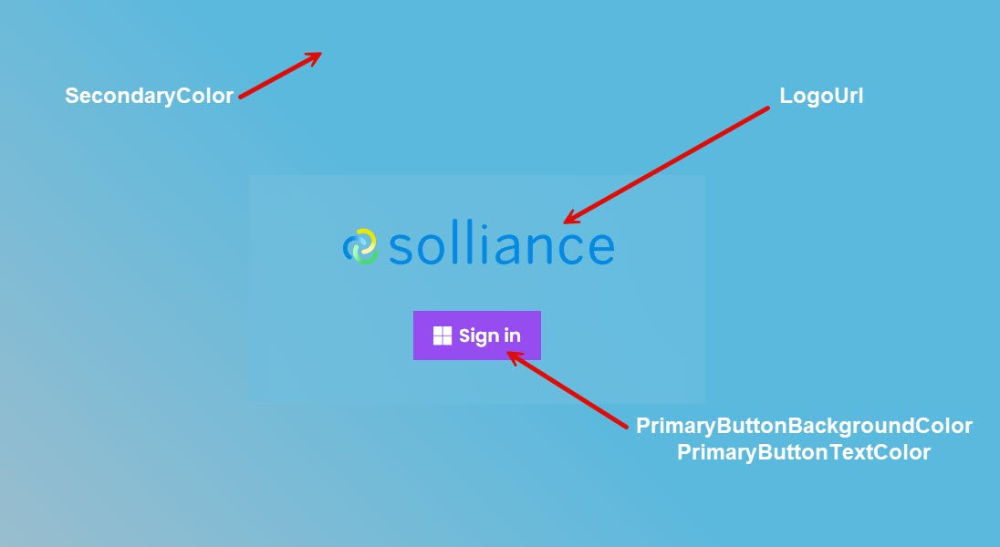
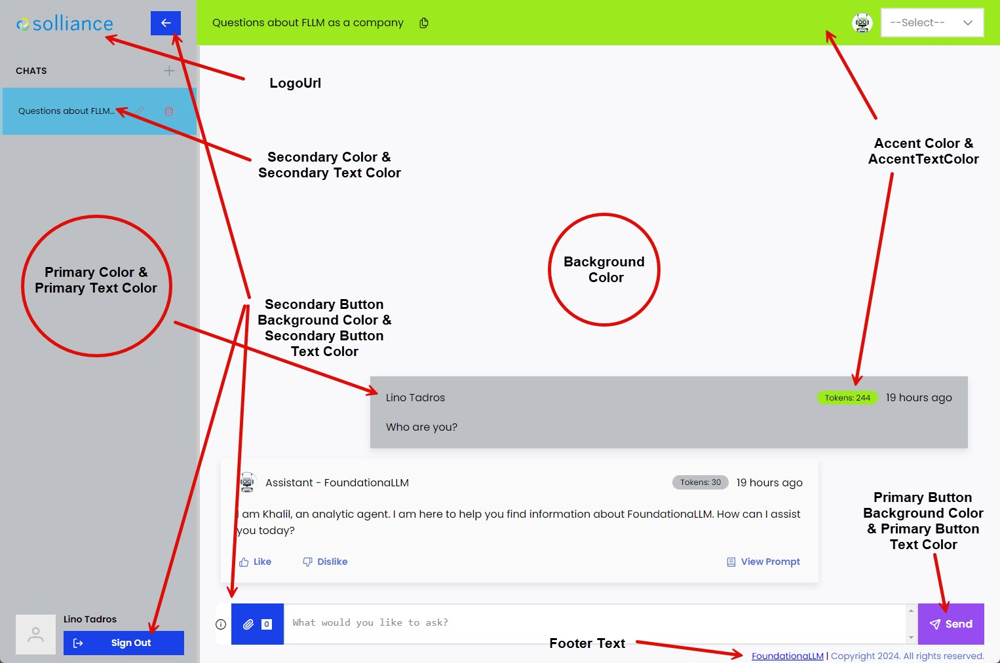
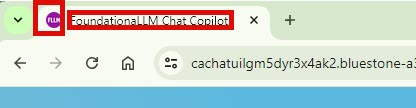

# Branding Customization

The `FoundationaLLM` application provides a way to customize the branding of the application. The branding customization can be done by setting any of the **18 configuration values** available in the `App Configuration` resource in your Azure Resource Group.  It can also be changed using the REST API calls pertaining to Branding.

### Accessing the App Configuration for branding customization

In your Azure Resource Group, navigate to the `App Configuration` resource and select the `Configuration Explorer` option under `Operations`. You will see a list of all configuration settings for `FoundationaLLM `m filter the list on the word `Branding` and you will be able to see the 18 relevant configuration settings pertaining to Branding.

### The default User Interface of the `FoundationaLLM` is shown below

### The Login screen can also be customized as shown below

### The chat window can be customized as shown below

## FoundationaLLM:Branding:AccentColor
Takes a hexadecimal color value to set the accent color of the chat application which is used for top header and the the token counter in the chat.
## FoundationaLLM:Branding:AccentTextColor
Takes a hexadecimal color value to set the accent text color of the chat application which is used for top header and the the token counter in the chat.
## FoundationaLLM:Branding:BackgroundColor
Takes a hexadecimal color value to set the background color of the chat application.
## FoundationaLLM:Branding:CompanyName
Not is use.  Reserved for future enhancements.

## FoundationaLLM:Branding:FavIconUrl
A string value to set the FavIcon Url which is displayed in the browser tab.
> [!IMPORTANT]
> The FavIconUrl can be an SVG or PNG image placed in the Public folder of the application's source code but will require rebuilding of the docker image to reflect the changes. The preferred way of setting the FavIconUrl is to set it to a relative accessible public URL to an SVG or PNG image.

> [!IMPORTANT]
> Any changes to the `FoundationaLLM:Branding:FavIconUrl` will require a restart of the `CoreAPI` image to take effect.

## FoundationaLLM:Branding:FooterText
A string value to set the Footer Text value which is displayed at the bottom right of the screen.
## FoundationaLLM:Branding:KioskMode
This is a boolean flag to indicate if the application is running in kiosk mode, if true will remove the sessions panel on the left navigation panel. 
## FoundationaLLM:Branding:LogoText
A string value to set the Logo Text value which is displayed only if the `FoundationaLLM:Branding:LogoUrl` is not set.
## FoundationaLLM:Branding:LogoUrl
A string value to set the Logo Url which is displayed in top left header and also in the login screen.
> [!IMPORTANT]
> The LogoUrl can be an SVG or PNG image placed in the Public folder of the application's source code but will require rebuilding of the docker image to reflect the changes. The preferred way of setting the LogoUrl is to set it to a relative accessible public URL to an SVG or PNG image.
## FoundationaLLM:Branding:PageTitle
A string value to set the Page Title value which is displayed in the browser tab.

> [!IMPORTANT]
> Any changes to the `FoundationaLLM:Branding:PageTitle` will require a restart of the `CoreAPI` image to take effect.
## FoundationaLLM:Branding:PrimaryButtonBackgroundColor
Takes a hexadecimal color value to set the Primary Button Background color of the chat application. It affects the `Send` button in the chat at the bottom right, the `Close` button the `View Prompt` screen and the `login` button in the login screen.
## FoundationaLLM:Branding:PrimaryButtonTextColor
Takes a hexadecimal color value to set the Primary Button Text color of the chat application. It affects the `Send` button in the chat at the bottom right, the `Close` button the `View Prompt` screen and the `login` button in the login screen.
## FoundationaLLM:Branding:PrimaryColor
Takes a hexadecimal color value to set the Primary color of the chat application. It affects the left navigation panel and the `User Message` panel in the chat.
## FoundationaLLM:Branding:PrimaryTextColor
Takes a hexadecimal color value to set the Primary Text color of the chat application. It affects the left navigation panel and the `User Message` panel in the chat.
## FoundationaLLM:Branding:SecondaryButtonBackgroundColor
Takes a hexadecimal color value to set the Secondary Button Background color of the chat application. It affects the `collapsable arrow` in the left navigation panel, the `Sign Out` bottom at the bottom and the `attachment` of files button in the chat window.
## FoundationaLLM:Branding:SecondaryButtonTextColor
Takes a hexadecimal color value to set the Secondary Button Text color of the chat application. It affects the `collapsable arrow` in the left navigation panel, the `Sign Out` bottom at the bottom and the `attachment` of files button in the chat window.
## FoundationaLLM:Branding:SecondaryColor
Takes a hexadecimal color value to set the Secondary color of the chat application. It affects the background color of the `session identifier` in the left navigations panel and the background of the entire `login screen`.
## FoundationaLLM:Branding:SecondaryTextColor
Takes a hexadecimal color value to set the Secondary Text color of the chat application. It affects the background color of the `session identifier` in the left navigations panel.
