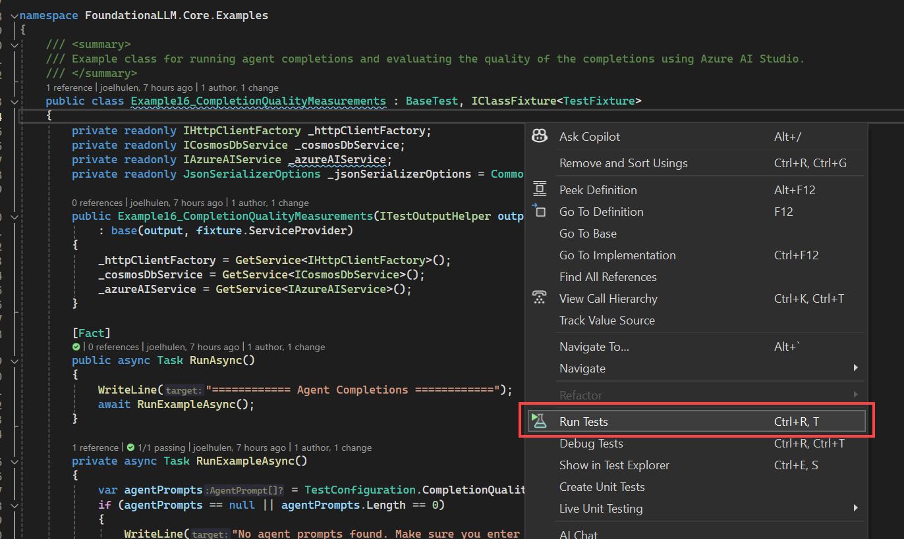

# Core Examples

This directory contains a collection of examples that demonstrate how to use the FoundationaLLM Core API. Each example is a standalone test that demonstrates a specific feature or capability of the Core API. You can run these examples using the Visual Studio Test Explorer, the command line, or by right-clicking on the test file and selecting **Run Tests**.

## Prerequisites

> [!IMPORTANT]
> Please ensure that you have [set up your local development environment](../../../docs/development/development-local.md#prerequisites) prerequisites.

1. Copy the `testsettings.example.json` file to `testsettings.json` and update the values based on your requirements.
2. Make sure you are signed in to Visual Studio with your account you use to access the Azure subscription to which your FoundationaLLM solution is deployed.
3. Log in to Azure via the Azure CLI using the command `az login`.

## Examples

### Example 16: Completion quality measurements with Azure AI Studio

**Purpose**: Verify that the completion quality measurements can be completed successfully with Azure AI Studio.

**File**: [Example16_CompletionQualityMeasurements.cs](Example16_CompletionQualityMeasurements.cs)

This example demonstrates how to use the FoundationaLLM Core API to send predefined user prompts with their expected outcomes to evaluate completion quality measurements with Azure AI Studio.

#### Setup

##### App Config settings

This example requires adding Azure AI Studio and its related storage account settings to the deployed App Config service. Create the following settings in the App Config service:

| Key | Default Value | Description |
| --- | --- | --- |
| `FoundationaLLM:AzureAIStudio:BaseUrl` | `https://ai.azure.com` | The base URL of the Azure AI Studio API. |
| `FoundationaLLM:AzureAIStudio:ContainerName` | N/A | Container where Azure AI Studio stores the data sets. |
| `FoundationaLLM:AzureAIStudio:SubscriptionId` | N/A | Subscription ID associated with the Azure AI Studio deployment. |
| `FoundationaLLM:AzureAIStudio:Region` | N/A | Region of the Azure AI Studio deployment. |
| `FoundationaLLM:AzureAIStudio:ResourceGroup` | N/A | Resource Group of the Azure AI Studio deployment. |
| `FoundationaLLM:AzureAIStudio:ProjectName` | N/A | Project Name of the Azure AI Studio deployment. |
| `FoundationaLLM:AzureAIStudio:Deployment` | `gpt-35-turbo-16k` | Azure AI Studio GPT model deployment name. |
| `FoundationaLLM:AzureAIStudio:Metrics` | `gpt_groundedness,gpt_relevance,gpt_coherence,gpt_fluency,gpt_similarity` | Metrics to run on the Azure AI Studio. |
| `FoundationaLLM:AzureAIStudio:FlowDefinitionResourceId` | N/A | The Flow Definition Resource ID of the Azure AI Studio. |
| `FoundationaLLM:AzureAIStudio:BlobStorageServiceSettings:AuthenticationType` | `ConnectionString` | The method by which this example connects to the storage account associated with the Azure AI Studio deployment. Valid options are `ConnectionString`, `AccountKey`, and `AzureIdentity`. |
| `FoundationaLLM:AzureAIStudio:BlobStorageServiceSettings:AccountName` | N/A | The name of the storage account. |
| `FoundationaLLM:AzureAIStudio:BlobStorageServiceSettings:AccountKey` | N/A | The account key if you are using the `AccountKey` connection type. We strongly recommend making this a Key Vault reference. |
| `FoundationaLLM:AzureAIStudio:BlobStorageServiceSettings:ConnectionString` | N/A | The account connection string if you are using the `ConnectionString` connection type. We strongly recommend making this a Key Vault reference. |

##### `testsettings.json` settings

Add one or more user prompts with their expected outcomes to the `testsettings.json` file within the `CompletionQualityMeasurementConfiguration` section. The example will use these prompts to evaluate completion quality measurements with Azure AI Studio.

Example:

```json
{
  "CompletionQualityMeasurementConfiguration": {
    "AgentPrompts": [
      {
        "AgentName": "FoundationaLLM",
        "SessionConfiguration": {
          "Sessionless": false,
          "CreateNewSession": true,
          "SessionId": ""
        },
        "UserPrompt": "What are the top three features that FoundationaLLM provides when it comes to asking questions about private data sources?",
        "ExpectedCompletion": "FoundationaLLM simplifies integration with enterprise data sources used by agents for in-context learning, provides fine-grain security controls over data used by agents, and offers pre/post completion filters that guard against attack."
      }
    ]
  },
}
```

Property definitions:

- `AgentPrompts`: An array of user prompts with their expected outcomes.
  - `AgentName`: The name of the agent sent to the Core API completions endpoint.
  - `SessionConfiguration`: Controls the configuration of the chat session  .
    - `Sessionless`: If `true`, the chat session will not be stored in the database and the session ID will be ignored. Default value is `false`.
    - `CreateNewSession`: Create a new chat session rather than using an existing one. Default value is `true`.
    - `SessionId`: If you are not creating a new chat session, enter the existing session ID here. Default value is an empty string.
  - `UserPrompt`: The user prompt sent to the Core API completions endpoint.
  - `ExpectedCompletion`: Used for quality measurements. The expected completion for the user prompt.

#### Running the example

1. Run the example by running a test on the `Example16_CompletionQualityMeasurements.cs` file. You can run the test using the Visual Studio Test Explorer, the command line, or by simply right-clicking anywhere on the `Example16_CompletionQualityMeasurements.cs` file and selecting **Run Tests**.

    

    You will see an output similar to the following after the test is completed:

    

2. The test will send the user prompt to the Core API completions endpoint and send the results and embedding information to Azure AI Studio for measuring the completion quality. To view the completion quality measurements, navigate to the [Azure AI Studio portal](https://ai.azure.com/) and select the project associated with the Azure AI Studio deployment. Select **Evaluation** in the left-hand menu and select the latest evaluation run to view the completion quality measurements.

    
