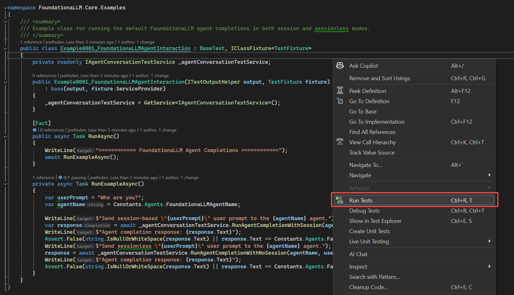
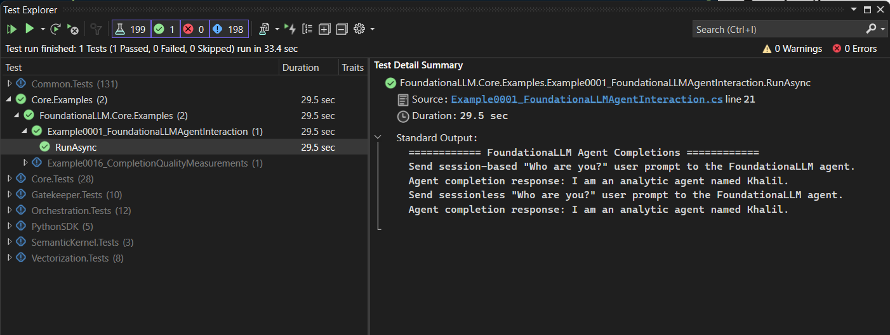
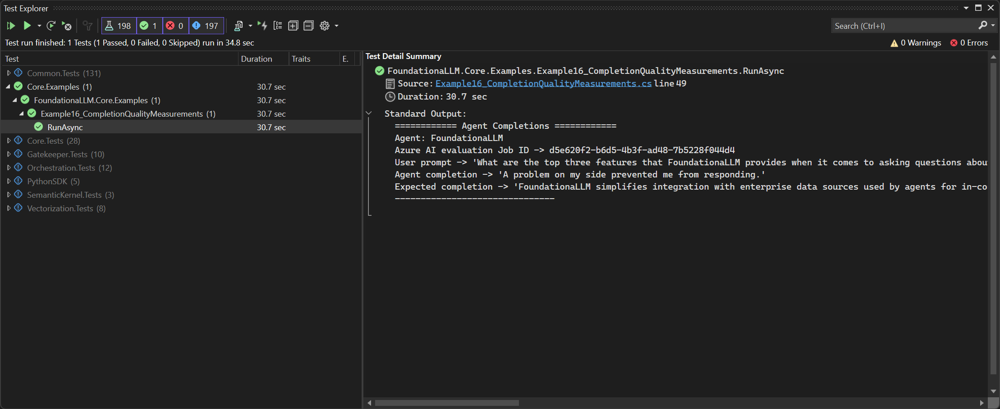
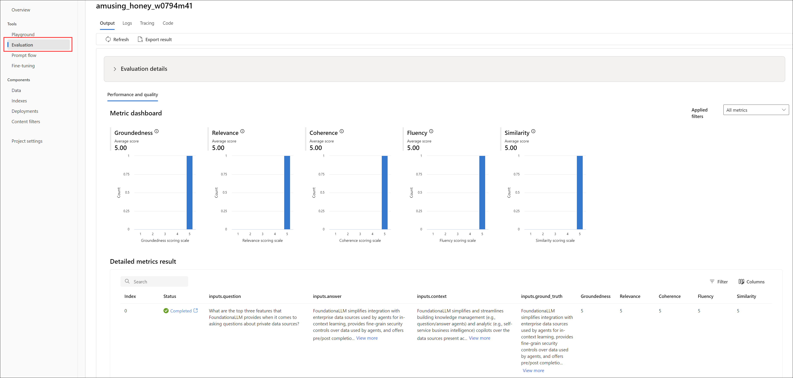

# Core Examples

This directory contains a collection of examples that demonstrate how to use the FoundationaLLM Core API. Each example is a standalone test that demonstrates a specific feature or capability of the Core API. You can run these examples using the Visual Studio Test Explorer, the command line, or by right-clicking on the test file and selecting **Run Tests**.

## Prerequisites

> [!IMPORTANT]
> Please ensure that you have [set up your local development environment](../../../docs/development/development-local.md#prerequisites) prerequisites.

1. Copy the `testsettings.example.json` file to `testsettings.json` and update the values based on your requirements.
2. Make sure you are signed in to Visual Studio with your account you use to access the Azure subscription to which your FoundationaLLM solution is deployed.
3. Log in to Azure via the Azure CLI using the command `az login`.

## Examples

### Example 1: FoundationaLLM agent interaction

**Purpose**: Verify that the `FoundationaLLM` agent is available and can respond to user queries.

**File**: [Example0001_FoundationaLLMAgentInteraction.cs](Example0001_FoundationaLLMAgentInteraction.cs)

This example demonstrates how to use the FoundationaLLM Core API to send user prompts to the default `FoundationaLLM` agent and receive completions. It sends both session-based and sessionless requests to the Core API.

#### Running the example

Run the example by running a test on the `Example0001_FoundationaLLMAgentInteraction.cs` file. You can run the test using the Visual Studio Test Explorer, the command line, or by simply right-clicking anywhere on the `Example0001_FoundationaLLMAgentInteraction.cs` file and selecting **Run Tests**.



You will see an output similar to the following after the test is completed:



### Example 3: Knowledge Management inline context agent with a LangChain orchestrator

**Purpose**: Create and use a Knowledge Management agent with an inline context that uses LangChain as the LLM orchestrator.

**File**: [Example0003_KnowledgeManagementInlineContextAgentWithLangChain.cs](Example0003_KnowledgeManagementInlineContextAgentWithLangChain.cs)

This example demonstrates creating a Knowledge Management agent with an inline context that uses LangChain as the LLM orchestrator. The agent's Prompt contains the data context about the Rosetta Stone, which the orchestrator sends to LangChain as part of the composed system prompt that provides the context the LLM uses to provide appropriate reponses to the user. The example sends questions about the Rosetta Stone to the agent and receives responses.

#### Setup

This example does not require any specific setup.

##### App Config settings

This example does not require any specific App Config settings.

#### Running the example

Run the example by running a test on the `Example0003_KnowledgeManagementInlineContextAgentWithLangChain.cs` file. You can run the test using the Visual Studio Test Explorer, the command line, or by simply right-clicking anywhere on the `Example0003_KnowledgeManagementInlineContextAgentWithLangChain.cs` file and selecting **Run Tests**.

You will see an output similar to the following after the test is completed:

```text
============ Knowledge Management with inline context agent using LangChain ============
Send Rosetta Stone questions to the FLLMGenericInlineContextTest agent.
Agent conversation history:
- User: Who are you?
- Assistant: I am Omar, an analytic agent here to help you understand the history of the Rosetta Stone.
- User: What is the significance of the Rosetta Stone in the history of linguistics?
- Assistant: The Rosetta Stone is of great significance in the history of linguistics because it played a crucial role in deciphering Egyptian hieroglyphs. The stone provided the key to understanding a script that had been lost for centuries, allowing scholars to unlock the language and gain insights into ancient Egyptian history and culture. This breakthrough opened up new avenues for studying and understanding ancient languages and scripts.
- User: What was the Rosetta Stone's role in ancient political dynamics?
- Assistant: The Rosetta Stone's role in ancient political dynamics was primarily as a decree affirming the royal cult of Pharaoh Ptolemy V. It was composed by a council of priests to honor the young pharaoh and likely served to reinforce his authority and legitimacy. The broader implications of the decree and its impact on Egyptian society during Ptolemy V's reign are still subjects of ongoing research and debate.
- User: How did the decipherment of the Rosetta Stone impact the study of ancient Egypt?
- Assistant: The decipherment of the Rosetta Stone had a significant impact on the study of ancient Egypt. It provided scholars with the key to understanding Egyptian hieroglyphs, which had previously been a mystery. This breakthrough allowed for the translation of numerous ancient Egyptian texts, providing valuable insights into their history, culture, religion, and daily life. The decipherment of the Rosetta Stone opened up new avenues for studying and interpreting ancient Egyptian civilization.
```

### Example 4: Synchronous vectorization of a file located in Azure Data Lake Storage Gen2

**Purpose**: Run synchronous vectorization of a file located in Azure Data Lake Storage Gen2.

**File**: [Example0004_SynchronousVectorizationOfPDFFromDataLake.cs](Example0004_SynchronousVectorizationOfPDFFromDataLake.cs)

This example demonstrates a synchronous vectorization request for a file located in a storage account.

#### Setup

This example expects the following file named [`SDZWA-Journal-January-2024.pdf`](https://sandiegozoowildlifealliance.org/Journal/january-2024) to be located `vectorization-input` container in the data lake storage account created with the FoundationaLLM deployment.

##### App Config settings

This test will create the App Config settings required by the Data Source. The Data Source Azure Blob Storage account name must be provided through the `AZURE_STORAGE_ACCOUNT_NAME` environment variable.

#### Running the example

Run the example by running a test on the `Example0004_SynchronousVectorizationOfPDFFromDataLake.cs` file. You can run the test using the Visual Studio Test Explorer, the command line, or by simply right-clicking anywhere on the `Example0004_SynchronousVectorizationOfPDFFromDataLake.cs` file and selecting **Run Tests**.

You will see an output similar to the following after the test is completed:

```text
============ Synchronous Vectorization of a PDF from Data Lake ============
Create the data source: datalake_vectorization_input via the Management API
Create the vectorization text partitioning profile: text_partition_profile via the Management API
Create the vectorization text embedding profile: text_embedding_profile_generic via the Management API
Create the vectorization indexing profile: indexing_profile_pdf via the Management API
Create the vectorization request: ab74c501-6e49-41ac-95bf-7284174564c8 via the Management API
Verify the vectorization request ab74c501-6e49-41ac-95bf-7284174564c8 was created by retrieving it from the Management API
Issue the process action on the vectorization request: ab74c501-6e49-41ac-95bf-7284174564c8 via the Management API
Vectorization request: ab74c501-6e49-41ac-95bf-7284174564c8 completed successfully.
Verify a search yields 27 documents.
Delete the data source: datalake_vectorization_input via the Management API
Delete the vectorization text partitioning profile: text_partition_profile via the Management API
Delete the vectorization text embedding profile: text_embedding_profile_generic via the Management API
Delete the vectorization indexing profile: indexing_profile_pdf via the Management API and delete the created index
```

### Example 5: Asynchronous vectorization of a file located in Azure Data Lake Storage Gen2

**Purpose**: Run synchronous vectorization of a file located in Azure Data Lake Storage Gen2.

**File**: [Example0005_AsynchronousVectorizationOfPDFFromDataLake.cs](Example0005_AsynchronousVectorizationOfPDFFromDataLake.cs)

This example demonstrates a synchronous vectorization request for a file located in a storage account.

#### Setup

This example expects the following file named [`SDZWA-Journal-January-2024.pdf`](https://sandiegozoowildlifealliance.org/Journal/january-2024) to be located `vectorization-input` container in the data lake storage account created with the FoundationaLLM deployment.

##### App Config settings

This test will create the App Config settings required by the Data Source. The Data Source Azure Blob Storage account name must be provided through the `AZURE_STORAGE_ACCOUNT_NAME` environment variable.

#### Running the example

Run the example by running a test on the `Example0005_AsynchronousVectorizationOfPDFFromDataLake.cs` file. You can run the test using the Visual Studio Test Explorer, the command line, or by simply right-clicking anywhere on the `Example0005_AsynchronousVectorizationOfPDFFromDataLake.cs` file and selecting **Run Tests**.

You will see an output similar to the following after the test is completed:

```text
============ Asynchronous Vectorization of a PDF from Data Lake ============
Create the data source: datalake_vectorization_input via the Management API
Create the vectorization text partitioning profile: text_partition_profile via the Management API
Create the vectorization text embedding profile: text_embedding_profile_generic via the Management API
Create the vectorization indexing profile: indexing_profile_pdf via the Management API
Create the vectorization request: 912e93ba-f5cb-4398-9ab6-c13f986269a2 via the Management API
Verify the vectorization request 912e93ba-f5cb-4398-9ab6-c13f986269a2 was created by retrieving it from the Management API
Issue the process action on the vectorization request: 912e93ba-f5cb-4398-9ab6-c13f986269a2 via the Management API
Get the initial processing state for the vectorization request: 912e93ba-f5cb-4398-9ab6-c13f986269a2 via the Management API
Polling the processing state of the async vectorization request: 912e93ba-f5cb-4398-9ab6-c13f986269a2 by retrieving the request from the Management API
Vectorization request: 912e93ba-f5cb-4398-9ab6-c13f986269a2 completed successfully.
Verify a search yields 27 documents.
Delete the data source: datalake_vectorization_input via the Management API
Delete the vectorization text partitioning profile: text_partition_profile via the Management API
Delete the vectorization text embedding profile: text_embedding_profile_generic via the Management API
Delete the vectorization indexing profile: indexing_profile_pdf via the Management API along with the index
```

### Example 6: Synchronous vectorization of a file located in a OneLake Lakehouse

**Purpose**: Run synchronous vectorization of a file located in a OneLake Lakehouse.

**File**: [Example0006_SynchronousVectorizationOfPDFFromOneLake.cs](Example0006_SynchronousVectorizationOfPDFFromOneLake.cs)

This example demonstrates a synchronous vectorization request for a file located in a OneLake Lakehouse.

#### Setup

This example expects the following file named [`SDZWA-Journal-January-2024.pdf`](https://sandiegozoowildlifealliance.org/Journal/january-2024) to be located in the `FoundationaLLM` workspace and `FoundationaLLM` lakehouse files.

##### Permissions

The vectorization api and vectorization job managed identities need to have `Contributor` permissions on the workspace.

##### App Config settings
| Key | Value | Description |
| --- | --- | --- |
| `FoundationaLLM:DataSources:onelake_fllm:AuthenticationType` | `AzureIdentity` | The authentication method for the vectorization api and vectorization job managed identities. This will always be `AzureIdentity`. |
| `FoundationaLLM:DataSources:onelake_fllm:AccountName` | `onelake` | Account name - this will always be `onelake`. |

#### Running the example

Run the example by running a test on the `Example0006_SynchronousVectorizationOfPDFFromOneLake.cs` file. You can run the test using the Visual Studio Test Explorer, the command line, or by simply right-clicking anywhere on the `Example0006_SynchronousVectorizationOfPDFFromOneLake.cs` file and selecting **Run Tests**.

You will see an output similar to the following after the test is completed:

```text
============ Synchronous Vectorization of a PDF from OneLake ============
Create the data source: onelake_fllm via the Management API
Create the vectorization text partitioning profile: text_partition_profile via the Management API
Create the vectorization text embedding profile: text_embedding_profile_generic via the Management API
Create the vectorization indexing profile: indexing_profile_pdf via the Management API
Create the vectorization request: f9eddadd-82a8-4068-8956-8669e0c1b020 via the Management API
Verify the vectorization request f9eddadd-82a8-4068-8956-8669e0c1b020 was created by retrieving it from the Management API
Issue the process action on the vectorization request: f9eddadd-82a8-4068-8956-8669e0c1b020 via the Management API
Vectorization request: f9eddadd-82a8-4068-8956-8669e0c1b020 completed successfully.
Verify a search yields 27 documents.
Delete the data source: onelake_fllm via the Management API
Delete the vectorization text partitioning profile: text_partition_profile via the Management API
Delete the vectorization text embedding profile: text_embedding_profile_generic via the Management API
Delete the vectorization indexing profile: indexing_profile_pdf via the Management API and delete the created index
```

### Example 7: Asynchronous vectorization of a file located in a OneLake Lakehouse

**Purpose**: Run asynchronous vectorization of a file located in a OneLake Lakehouse.

**File**: [Example0007_AsynchronousVectorizationOfPDFFromOneLake.cs](Example0007_AsynchronousVectorizationOfPDFFromOneLake.cs)

This example demonstrates a synchronous vectorization request for a file located in a OneLake Lakehouse.

#### Setup

This example expects the following file named [`SDZWA-Journal-January-2024.pdf`](https://sandiegozoowildlifealliance.org/Journal/january-2024) to be located in the `FoundationaLLM` workspace and `FoundationaLLM` lakehouse files.

##### Permissions

The vectorization api and vectorization job managed identities need to have `Contributor` permissions on the workspace.

##### App Config settings
| Key | Value | Description |
| --- | --- | --- |
| `FoundationaLLM:DataSources:onelake_fllm:AuthenticationType` | `AzureIdentity` | The authentication method for the vectorization api and vectorization job managed identities. This will always be `AzureIdentity`. |
| `FoundationaLLM:DataSources:onelake_fllm:AccountName` | `onelake` | Account name - this will always be `onelake`. |

#### Running the example

Run the example by running a test on the `Example0007_AsynchronousVectorizationOfPDFFromOneLake.cs` file. You can run the test using the Visual Studio Test Explorer, the command line, or by simply right-clicking anywhere on the `Example0007_AsynchronousVectorizationOfPDFFromOneLake.cs` file and selecting **Run Tests**.

You will see an output similar to the following after the test is completed:

```text
============ Asynchronous Vectorization of a PDF from OneLake ============
Create the data source: onelake_fllm via the Management API
Create the vectorization text partitioning profile: text_partition_profile via the Management API
Create the vectorization text embedding profile: text_embedding_profile_generic via the Management API
Create the vectorization indexing profile: indexing_profile_pdf via the Management API
Create the vectorization request: d698a965-d3a7-4211-9b61-08d445a8fc31 via the Management API
Verify the vectorization request d698a965-d3a7-4211-9b61-08d445a8fc31 was created by retrieving it from the Management API
Issue the process action on the vectorization request: d698a965-d3a7-4211-9b61-08d445a8fc31 via the Management API
Get the initial processing state for the vectorization request: d698a965-d3a7-4211-9b61-08d445a8fc31 via the Management API
Polling the processing state of the async vectorization request: d698a965-d3a7-4211-9b61-08d445a8fc31 by retrieving the request from the Management API
Vectorization request: d698a965-d3a7-4211-9b61-08d445a8fc31 completed successfully.
Verify a search yields 27 documents.
Delete the data source: onelake_fllm via the Management API
Delete the vectorization text partitioning profile: text_partition_profile via the Management API
Delete the vectorization text embedding profile: text_embedding_profile_generic via the Management API
Delete the vectorization indexing profile: indexing_profile_pdf via the Management API and delete the created index
```

### Example 8: Synchronous vectorization of a file located in SharePoint Online

**Purpose**: Run synchronous vectorization of a file located SharePoint Online.

**File**: [Example0008_SynchronousVectorizationOfPDFFromSharePoint.cs](Example0008_SynchronousVectorizationOfPDFFromSharePoint.cs)

This example demonstrates a synchronous vectorization request for a file located in SharePoint Online.

#### Setup

This example expects a service principal to be created using the following guidance: [Sharepoint: Setting up an Azure AD app for app-only access](https://learn.microsoft.com/en-us/sharepoint/dev/solution-guidance/security-apponly-azuread#setting-up-an-azure-ad-app-for-app-only-access).

The certificate used to authenticate the service principal needs to be uploaded to the Azure Key Vault.

This example expects the following file named [`SDZWA-Journal-January-2024.pdf`](https://sandiegozoowildlifealliance.org/Journal/january-2024) to be located in a SharePoint Online site.

##### App Config settings
| Key | Value | Description |
| --- | --- | --- |
| `FoundationaLLM:DataSources:sharepoint_fllm:ClientId` | N/A | The ClientId of the service principal accessing SharePoint Online. |
| `FoundationaLLM:DataSources:sharepoint_fllm:TenantId` | N/A | The TenantId of the serivce principal accessing SharePoint Online. |
| `FoundationaLLM:DataSources:sharepoint_fllm:CertificateName` | N/A | The name of the certificate in the Azure Key Vault used to authenticate the service principal. |
| `FoundationaLLM:DataSources:sharepoint_fllm:KeyVaultURL` | N/A | The URL of the Azure Key Vault where the certificate is stored. |

##### `testsettings.json` settings

The test settings file provides information to the vectorization service about the location and file name of the document to vectorize. The following is an example of the `testsettings.json` file for this example:

```json
{
  "SharePointVectorizationConfiguration": {
	"HostName": "fllm.sharepoint.com",
	"SitePath": "sites/FoundationaLLM",
	"FolderPath": "Shared Documents/SDZWA/Journals",
	"FileName": "SDZWA-Journal-January-2024.pdf"
  }
}
```

Property definitions:

- `HostName`: Host name of the SharePoint site without the protocol, ex: `fllm.sharepoint.com`.
- `SitePath`: The relative path of the site/subsite, ex: `/sites/FoundationaLLM`.
- `FolderPath`: The folder path, starting with the document library, ex: `SDZWA/Journals`.
- `FileName`: The file name of the document to vectorize.

#### Running the example

Run the example by running a test on the `Example0008_SynchronousVectorizationOfPDFFromSharePoint.cs` file. You can run the test using the Visual Studio Test Explorer, the command line, or by simply right-clicking anywhere on the `Example0008_SynchronousVectorizationOfPDFFromSharePoint.cs` file and selecting **Run Tests**.

You will see an output similar to the following after the test is completed:

```text
============ Synchronous Vectorization of a PDF from SharePoint Online ============
Create the data source: sharepoint_fllm via the Management API
Create the vectorization text partitioning profile: text_partition_profile via the Management API
Create the vectorization text embedding profile: text_embedding_profile_generic via the Management API
Create the vectorization indexing profile: indexing_profile_pdf via the Management API
Create the vectorization request: 01f507af-7780-4c5e-b8e8-198e7ea6fcb0 via the Management API
Verify the vectorization request 01f507af-7780-4c5e-b8e8-198e7ea6fcb0 was created by retrieving it from the Management API
Issue the process action on the vectorization request: 01f507af-7780-4c5e-b8e8-198e7ea6fcb0 via the Management API
Vectorization request: 01f507af-7780-4c5e-b8e8-198e7ea6fcb0 completed successfully.
Verify a search yields 27 documents.
Delete the data source: sharepoint_fllm via the Management API
Delete the vectorization text partitioning profile: text_partition_profile via the Management API
Delete the vectorization text embedding profile: text_embedding_profile_generic via the Management API
Delete the vectorization indexing profile: indexing_profile_pdf via the Management API along with the index
```

### Example 9: Asynchronous vectorization of a file located in SharePoint Online

**Purpose**: Run asynchronous vectorization of a file located SharePoint Online.

**File**: [Example0009_AsynchronousVectorizationOfPDFFromSharePoint.cs](Example0009_AsynchronousVectorizationOfPDFFromSharePoint.cs)

This example demonstrates an asynchronous vectorization request for a file located in SharePoint Online.

#### Setup

This example expects a service principal to be created using the following guidance: [Sharepoint: Setting up an Azure AD app for app-only access](https://learn.microsoft.com/en-us/sharepoint/dev/solution-guidance/security-apponly-azuread#setting-up-an-azure-ad-app-for-app-only-access).

The certificate used to authenticate the service principal needs to be uploaded to the Azure Key Vault.

This example expects the following file named [`SDZWA-Journal-January-2024.pdf`](https://sandiegozoowildlifealliance.org/Journal/january-2024) to be located in a SharePoint Online site.

##### App Config settings
| Key | Value | Description |
| --- | --- | --- |
| `FoundationaLLM:DataSources:sharepoint_fllm:ClientId` | N/A | The ClientId of the service principal accessing SharePoint Online. |
| `FoundationaLLM:DataSources:sharepoint_fllm:TenantId` | N/A | The TenantId of the serivce principal accessing SharePoint Online. |
| `FoundationaLLM:DataSources:sharepoint_fllm:CertificateName` | N/A | The name of the certificate in the Azure Key Vault used to authenticate the service principal. |
| `FoundationaLLM:DataSources:sharepoint_fllm:KeyVaultURL` | N/A | The URL of the Azure Key Vault where the certificate is stored. |

##### `testsettings.json` settings

The test settings file provides information to the vectorization service about the location and file name of the document to vectorize. The following is an example of the `testsettings.json` file for this example:

```json
{
  "SharePointVectorizationConfiguration": {
	"HostName": "fllm.sharepoint.com",
	"SitePath": "sites/FoundationaLLM",
	"FolderPath": "Shared Documents/SDZWA/Journals",
	"FileName": "SDZWA-Journal-January-2024.pdf"
  }
}
```

Property definitions:

- `HostName`: Host name of the SharePoint site without the protocol, ex: `fllm.sharepoint.com`.
- `SitePath`: The relative path of the site/subsite, ex: `/sites/FoundationaLLM`.
- `FolderPath`: The folder path, starting with the document library, ex: `SDZWA/Journals`.
- `FileName`: The file name of the document to vectorize.

#### Running the example

Run the example by running a test on the `Example0009_AsynchronousVectorizationOfPDFFromSharePoint.cs` file. You can run the test using the Visual Studio Test Explorer, the command line, or by simply right-clicking anywhere on the `Example0009_AsynchronousVectorizationOfPDFFromSharePoint.cs` file and selecting **Run Tests**.

You will see an output similar to the following after the test is completed:

```text
============ Asynchronous Vectorization of a PDF from SharePoint Online ============
Create the data source: sharepoint_fllm via the Management API
Create the vectorization text partitioning profile: text_partition_profile via the Management API
Create the vectorization text embedding profile: text_embedding_profile_generic via the Management API
Create the vectorization indexing profile: indexing_profile_pdf via the Management API
Create the vectorization request: 2b88e6d2-a51c-4e38-b5d7-e1a7f72cb694 via the Management API
Verify the vectorization request 2b88e6d2-a51c-4e38-b5d7-e1a7f72cb694 was created by retrieving it from the Management API
Issue the process action on the vectorization request: 2b88e6d2-a51c-4e38-b5d7-e1a7f72cb694 via the Management API
Get the initial processing state for the vectorization request: 2b88e6d2-a51c-4e38-b5d7-e1a7f72cb694 via the Management API
Polling the processing state of the async vectorization request: 2b88e6d2-a51c-4e38-b5d7-e1a7f72cb694 by retrieving the request from the Management API
Vectorization request: 2b88e6d2-a51c-4e38-b5d7-e1a7f72cb694 completed successfully.
Verify a search yields 27 documents.
Delete the data source: sharepoint_fllm via the Management API
Delete the vectorization text partitioning profile: text_partition_profile via the Management API
Delete the vectorization text embedding profile: text_embedding_profile_generic via the Management API
Delete the vectorization indexing profile: indexing_profile_pdf via the Management API and delete the created index
```

### Example 11: Knowledge Management agent with Semantic Kernel on the SDZWA journal

**Purpose**: Verify that the Knowledge Management agent with Semantic Kernel can respond to user queries using the SDZWA journals.

**File**: [Example0011_KnowledgeManagementAgentWithSemanticKernel.cs](Example0011_KnowledgeManagementAgentWithSemanticKernel.cs)

This example demonstrates how to use the Management API to create an the agent and how to use the Core API to send user prompts to the agent and receive completions.

#### Running the example

Run the example by running a test on the `Example0011_KnowledgeManagementAgentWithSemanticKernel.cs` file. You can run the test using the Visual Studio Test Explorer, the command line, or by simply right-clicking anywhere on the `Example0011_KnowledgeManagementAgentWithSemanticKernel.cs` file and selecting **Run Tests**.

You will see an output similar to the following after the test is completed:

```text
============ Knowledge Management agent with Lang Chain on SDZWA ============
Send questions to the KMAgentWithLangChainSDZWA agent.
Agent conversation history:
- User: Who are you?
- Assistant: I am Sandy, the San Diego Zoo assistant.
- User: Tell me one interesting facts about the San Diego Zoo?
- Assistant: One interesting fact about the San Diego Zoo is that between the botanical gardens at the San Diego Zoo and the Safari Park, they care for 2 million plants.
- User: How many animals does the San Diego Zoo host?
- Assistant: The journal does not provide information about the number of animals hosted by the San Diego Zoo.
- User: What does the San Diego Zoo do to treat illness among it's inhabitants?
- Assistant: The journal mentions that the San Diego Zoo provides efficient and effective health care for its animals. The care and health decisions are based on the best available scientific data.
```

### Example 12: Knowledge Management agent with Lang Chain on the SDZWA journal

**Purpose**: Verify that the Knowledge Management agent with Lang Chain can respond to user queries using the SDZWA journals.

**File**: [Example0012_KnowledgeManagementAgentWithLangChain.cs](Example0012_KnowledgeManagementAgentWithLangChain.cs)

This example demonstrates how to use the Management API to create an the agent and how to use the Core API to send user prompts to the agent and receive completions.

#### Running the example

Run the example by running a test on the `Example0012_KnowledgeManagementAgentWithLangChain.cs` file. You can run the test using the Visual Studio Test Explorer, the command line, or by simply right-clicking anywhere on the `Example0011_KnowledgeManagementAgentWithSemanticKernel.cs` file and selecting **Run Tests**.

You will see an output similar to the following after the test is completed:

```text
============ Knowledge Management agent with Lang Chain on SDZWA ============
Send questions to the KMAgentWithLangChainSDZWA agent.
Agent conversation history:
- User: Who are you?
- Assistant: I am Sandy, the San Diego Zoo assistant.
- User: Tell me one interesting facts about the San Diego Zoo?
- Assistant: One interesting fact about the San Diego Zoo is that between the botanical gardens at the San Diego Zoo and the Safari Park, they care for 2 million plants.
- User: How many animals does the San Diego Zoo host?
- Assistant: The journal does not provide information about the number of animals hosted by the San Diego Zoo.
- User: What does the San Diego Zoo do to treat illness among it's inhabitants?
- Assistant: The journal mentions that the San Diego Zoo provides efficient and effective health care for its animals. The care and health decisions are based on the best available scientific data.
```

### Example 13: Knowledge Management agent with Semantic Kernel on Dune

**Purpose**: Verify that the Knowledge Management agent with Semantic Kernel can respond to user queries using Dune.

**File**: [Example0013_KnowledgeManagementSemanticKernelWithLargeIndex.cs](Example0013_KnowledgeManagementSemanticKernelWithLargeIndex.cs)

This example demonstrates how to use the Management API to create a Knowledge Management agent without an Inline Context and how to use the Core API to send user prompts to the agent and receive completions.

#### Setup

##### Azure AI Search Index

This test requires an index called `fllm-dune` located in the deployment's Azure AI Search service.

#### Running the example

Run the example by running a test on the `Example0013_KnowledgeManagementSemanticKernelWithLargeIndex.cs` file. You can run the test using the Visual Studio Test Explorer, the command line, or by simply right-clicking anywhere on the `Example0013_KnowledgeManagementSemanticKernelWithLargeIndex.cs` file and selecting **Run Tests**.

You will see an output similar to the following after the test is completed:

```text
 ============ Knowledge Management agent with SemanticKernel on Dune ============
Send questions to the KMAgentWithSemanticKernelDune agent.
Agent conversation history:
- User: Who are you?
- Assistant: I am an intelligent assistant for the world of Dune, also known as Arrakis.
- User: Who is the enemy of Paul Atreides?
- Assistant: The enemy of Paul Atreides is the Emperor.
- User: Who is 'Paul-Muad'Dib' and what is his relationship to the Fremen?
- Assistant: Paul-Muad'Dib is a character in the world of Dune. He is also known as the Mahdi or the Lisan al-Gaib. Paul is the son of Duke Leto Atreides and Lady Jessica and becomes a leader among the Fremen, a group of desert-dwelling people on the planet Arrakis, also known as Dune. The Fremen see him as their messiah and a figure of religious and political importance. They believe he possesses wisdom, strength, and the ability to create water, hide from the sun, and multiply over the land. Paul's relationship with the Fremen is one of acceptance and respect, and he becomes their leader and instructor, particularly in the ways of the desert.
```

### Example 14: Knowledge Management agent with LangChain on Dune

**Purpose**: Verify that the Knowledge Management agent with LangChain can respond to user queries using Dune.

**File**: [Example0014_KnowledgeManagementLangChainWithLargeIndex.cs](Example0014_KnowledgeManagementLangChainWithLargeIndex.cs)

This example demonstrates how to use the Management API to create a Knowledge Management agent without an Inline Context and how to use the Core API to send user prompts to the agent and receive completions.

#### Setup

##### Azure AI Search Index

This test requires an index called `fllm-dune` located in the deployment's Azure AI Search service.

#### Running the example

Run the example by running a test on the `Example0014_KnowledgeManagementLangChainWithLargeIndex.cs` file. You can run the test using the Visual Studio Test Explorer, the command line, or by simply right-clicking anywhere on the `Example0014_KnowledgeManagementLangChainWithLargeIndex.cs` file and selecting **Run Tests**.

You will see an output similar to the following after the test is completed:

```text
 ============ Knowledge Management agent with LangChain on Dune ============
Send questions to the KMAgentWithLangChainDune agent.
Agent conversation history:
- User: Who are you?
- Assistant: I am an intelligent assistant for the world of Dune, also known as Arrakis.
- User: Who is the enemy of Paul Atreides?
- Assistant: The enemy of Paul Atreides is the Emperor.
- User: Who is 'Paul-Muad'Dib' and what is his relationship to the Fremen?
- Assistant: Paul-Muad'Dib is a character in the world of Dune. He is also known as the Mahdi or the Lisan al-Gaib. Paul is the son of Duke Leto Atreides and Lady Jessica and becomes a leader among the Fremen, a group of desert-dwelling people on the planet Arrakis, also known as Dune. The Fremen see him as their messiah and a figure of religious and political importance. They believe he possesses wisdom, strength, and the ability to create water, hide from the sun, and multiply over the land. Paul's relationship with the Fremen is one of acceptance and respect, and he becomes their leader and instructor, particularly in the ways of the desert.
```

### Example 15: Agent-to-Agent Conversations on Dune

**Purpose**: Verify that the Agent-to-Agent Conversations on Dune can respond to user queries.

**File**: [Example0015_AgentToAgentConversations.cs](Example0015_AgentToAgentConversations.cs)

This example creates three agents, but it only sends requests to `DuneAuthorityAgentWithSemanticKernelInlineContext`.

- `DuneAuthorityAgentWithSemanticKernelInlineContext`: This agent sends requests to other agents based on their descriptions.
- `DuneAgentWithSemanticKernelInlineContext`: This agent crafts poems about Dune.
- `KMAgentWithSemanticKernelDune`: This agent answers questions about the Dune books using an Azure AI Search index.

#### Setup

##### Azure AI Search Index

This test requires an index called `fllm-dune` located in the deployment's Azure AI Search service.

#### Running the example

Run the example by running a test on the `Example0015_AgentToAgentConversations.cs` file. You can run the test using the Visual Studio Test Explorer, the command line, or by simply right-clicking anywhere on the `Example0015_AgentToAgentConversations.cs` file and selecting **Run Tests**.

You will see an output similar to the following after the test is completed:

```text
============ Agent-to-Agent Conversations with SemanticKernel on Dune ============
Send questions to the DuneAuthorityAgentWithSemanticKernelInlineContext agent.
Agent conversation history:
- User: Who is 'Paul-Muad'Dib' and what is his relationship to the Fremen?
- Assistant: Paul-Muad'Dib, born as Paul Atreides, was the leader of the House Atreides and later became known as Muad'Dib, the Mahdi of all the Fremen. He forged a strong and lasting relationship with the Fremen, the native inhabitants of the desert planet Arrakis.

The Fremen, initially skeptical of outsiders, came to recognize Paul's unique abilities and his understanding of the desert way of life. They saw him as their messiah and rallied behind his cause. Inspired by his leadership, the Fremen spread across the universe in a religious government, influenced by Paul's teachings and his vision.

Paul-Muad'Dib's relationship with the Fremen was marked by mutual respect and loyalty. He treated the Fremen as equals and valued their wisdom and knowledge of the harsh desert environment. In turn, the Fremen regarded Paul as their leader and embraced his teachings and strategies.

Together, Paul-Muad'Dib and the Fremen conquered their enemies and fought against oppression. They formed a powerful and unbreakable bond, united by their shared purpose and commitment to each other. The Fremen followed Paul's commands without question, and he relied on their skills and expertise to navigate the challenges they faced.

Paul-Muad'Dib's relationship with the Fremen was a cornerstone of his journey and his ultimate success in transforming Arrakis and shaping the destiny of the universe. He embodied their values and traditions, becoming not only their leader but also their inspiration and hope for a better future.

- User: Write a poem about Paul's ambition.
- Assistant: In realms of battles fierce and grand,
Where valor bloomed and fate did stand,
There rose a young and fearless man,
Ambition forged in desert sand.

Paul Atreides, with eyes of flame,
A noble heart, a destined claim,
With dreams that stirred the echoes bold,
In his veins, a legacy untold.

Endowed with mystic prescience rare,
He saw a future none could share,
A path diverged, a choice to make,
To seize a universe at stake.

His soul ablaze like stars set high,
A burning light that could not die,
In every step, in every breath,
Fulfillment danced upon his quest.

Through every trial, every test,
He emerged, resolute and blessed,
A warrior, fierce and wise with might,
Unyielding in the darkest night.

Yet blossomed within him a fire untamed,
A thirst for power, untamed as it claimed,
For ambition, a double-edged blade,
On destiny's wings, his heart betrayed.

For noble as his cause might be,
Ambition gilded chains so free,
Conquering worlds, he sought to grow,
But chains of power may not bestow.

In passion's grip, his heart entwined,
A burning star of dreams combined,
Yet shadows lingered, consuming the light,
An empire's fate hung in the night.

The cost he paid, both dark and dear,
A web of choices, whispers near,
In each step forward, sacrifice ablaze,
A struggle eternal, through endless days.

Paul Atreides, a warrior's grace,
With love and power he sought to embrace,
Ambition's dance a perilous waltz,
A journey paved with noble faults.

Thus, let his ambition be praised,
For in his soul, desire blazed,
Oh, Paul Atreides, your yearning unfurled,
A tragic hero, king of the world.
```

### Example 16: Completion quality measurements with Azure AI Studio

**Purpose**: Verify that the completion quality measurements can be completed successfully with Azure AI Studio.

**File**: [Example0016_CompletionQualityMeasurements.cs](Example0016_CompletionQualityMeasurements.cs)

This example demonstrates how to use the FoundationaLLM Core API to send predefined user prompts with their expected outcomes to evaluate completion quality measurements with Azure AI Studio.

#### Setup

##### App Config settings

This example requires adding Azure AI Studio and its related storage account settings to the deployed App Config service. Create the following settings in the App Config service:

| Key | Default Value | Description |
| --- | --- | --- |
| `FoundationaLLM:AzureAIStudio:BaseUrl` | `https://ai.azure.com` | The base URL of the Azure AI Studio API. |
| `FoundationaLLM:AzureAIStudio:ContainerName` | N/A | Container where Azure AI Studio stores the data sets. |
| `FoundationaLLM:AzureAIStudio:SubscriptionId` | N/A | Subscription ID associated with the Azure AI Studio deployment. |
| `FoundationaLLM:AzureAIStudio:Region` | N/A | Region of the Azure AI Studio deployment. |
| `FoundationaLLM:AzureAIStudio:ResourceGroup` | N/A | Resource Group of the Azure AI Studio deployment. |
| `FoundationaLLM:AzureAIStudio:ProjectName` | N/A | Project Name of the Azure AI Studio deployment. |
| `FoundationaLLM:AzureAIStudio:Deployment` | `gpt-35-turbo-16k` | Azure AI Studio GPT model deployment name. |
| `FoundationaLLM:AzureAIStudio:Metrics` | `gpt_groundedness,gpt_relevance,gpt_coherence,gpt_fluency,gpt_similarity` | Metrics to run on the Azure AI Studio. |
| `FoundationaLLM:AzureAIStudio:FlowDefinitionResourceId` | N/A | The Flow Definition Resource ID of the Azure AI Studio. |
| `FoundationaLLM:AzureAIStudio:BlobStorageServiceSettings:AuthenticationType` | `ConnectionString` | The method by which this example connects to the storage account associated with the Azure AI Studio deployment. Valid options are `ConnectionString`, `AccountKey`, and `AzureIdentity`. |
| `FoundationaLLM:AzureAIStudio:BlobStorageServiceSettings:AccountName` | N/A | The name of the storage account. |
| `FoundationaLLM:AzureAIStudio:BlobStorageServiceSettings:AccountKey` | N/A | The account key if you are using the `AccountKey` connection type. We strongly recommend making this a Key Vault reference. |
| `FoundationaLLM:AzureAIStudio:BlobStorageServiceSettings:ConnectionString` | N/A | The account connection string if you are using the `ConnectionString` connection type. We strongly recommend making this a Key Vault reference. |

##### `testsettings.json` settings

Add one or more user prompts with their expected outcomes to the `testsettings.json` file within the `CompletionQualityMeasurementConfiguration` section. The example will use these prompts to evaluate completion quality measurements with Azure AI Studio.

Example:

```json
{
  "CompletionQualityMeasurementConfiguration": {
    "AgentPrompts": [
      {
        "AgentName": "FoundationaLLM",
        "CreateAgent": false,
        "SessionConfiguration": {
          "Sessionless": false,
          "CreateNewSession": true,
          "SessionId": ""
        },
        "UserPrompt": "What are the top three features that FoundationaLLM provides when it comes to asking questions about private data sources?",
        "ExpectedCompletion": "FoundationaLLM simplifies integration with enterprise data sources used by agents for in-context learning, provides fine-grain security controls over data used by agents, and offers pre/post completion filters that guard against attack."
      }
    ]
  },
}
```

Property definitions:

- `AgentPrompts`: An array of user prompts with their expected outcomes.
  - `AgentName`: The name of the agent sent to the Core API completions endpoint.
  - `CreateAgent`: Indicates whether to create a new agent for the test run. If `true`, the agent will be created and deleted. If set to `true`, make sure you add the agent to the `Catalogs.AgentCatalog`. Default value is `false`.
  - `SessionConfiguration`: Controls the configuration of the chat session  .
    - `Sessionless`: If `true`, the chat session will not be stored in the database and the session ID will be ignored. Default value is `false`.
    - `CreateNewSession`: Create a new chat session rather than using an existing one. Default value is `true`.
    - `SessionId`: If you are not creating a new chat session, enter the existing session ID here. Default value is an empty string.
  - `UserPrompt`: The user prompt sent to the Core API completions endpoint.
  - `ExpectedCompletion`: Used for quality measurements. The expected completion for the user prompt.

#### Authentication

Prior to running the test, open a command prompt and run the following command to authenticate with the Azure AI Studio deployment:

```bash
azd auth login
```

#### Running the example

1. Run the example by running a test on the `Example16_CompletionQualityMeasurements.cs` file. You can run the test using the Visual Studio Test Explorer, the command line, or by simply right-clicking anywhere on the `Example16_CompletionQualityMeasurements.cs` file and selecting **Run Tests**.

    You will see an output similar to the following after the test is completed:

    

2. The test will send the user prompt to the Core API completions endpoint and send the results and embedding information to Azure AI Studio for measuring the completion quality. To view the completion quality measurements, navigate to the [Azure AI Studio portal](https://ai.azure.com/) and select the project associated with the Azure AI Studio deployment. Select **Evaluation** in the left-hand menu and select the latest evaluation run to view the completion quality measurements.

    

### Example 20: Generate synthetic user-agent conversations based on prodct descriptions

**Purpose**: Test an agent that generates synthetic user-agent conversations using a registry of fictional e-shop products.

**File**: [Example0020_GenerateConversationsAboutProducts.cs](./Example0020_GenerateConversationsAboutProducts.cs)

This example demonstrates calling an agent that generates synthetic user-agent conversations.

#### Setup

This example does not require any specific setup.

##### App Config settings

This example does not require any specific App Config settings.

##### `testsettings.json` settings

The test settings file provides details about the conversation generation process. The following is a sample of the `testsettings.json` file for this example:

```json
{
  "GenerateConversationsConfiguration": {
    "ResultFolderPath": null,
    "ConversationCount": 1,
    "ThreadCount":  5
  }
}
```

Property definitions:

- `ResultFolderPath`: The path to a local folder where the generated conversations will be saved. If `null`, the conversations will not be saved locally. When saved locally, the resulting file name is `synthetic-conversations.json`. Default value is `null`.
- `ConversationCount`: The number of conversations to generate. Default value is `1`.
- `ThreadCount`: The number of threads to use for generating conversations in parallel. Default value is `5`.

#### Running the example

Run the example by running a test on the `Example0020_GenerateConversationsAboutProducts.cs` file. You can run the test using the Visual Studio Test Explorer, the command line, or by simply right-clicking anywhere on the `Example0020_GenerateConversationsAboutProducts.cs` file and selecting **Run Tests**.

You will see an output similar to the following after the test is completed:

```text
============ Generate conversations about products ============
Asking the agent ConversationGeneratorAgent agent to create conversation # 1...
Conversation # 1 was created successfully.
```